# GymUnity — DATA_FLOW.md

> How data moves through the system, end-to-end. Updated to reflect the full recommender system implementation as of 2026-02-24.

---

# 1) Legend (Read This First)

| Abbreviation | Meaning |
|---|---|
| **UI** | Frontend — React SPA running in the browser (port `3000`) |
| **API** | Backend — FastAPI Python server (port `8000`) |
| **DB** | Database — SQLite file (`backend/gymunity.db`) — 12 tables |
| **VDB** | Vector Database — Chroma (dev) / Qdrant (prod) / Null (fallback) |
| **JWT** | JSON Web Token — a signed string the API gives the UI after login |
| **Token** | The `access_token` (JWT) stored in `localStorage` |
| **State** | React component state (`useState`) — lives only in memory while the page is open |
| **Request** | An HTTP call the UI makes to the API (`fetch()`) |
| **Response** | The JSON the API sends back |
| **Bearer** | The `Authorization: Bearer <token>` header attached to every authenticated request |

### Token lifecycle in one sentence

> UI sends credentials → API returns a JWT → UI saves it in `localStorage` → every future request attaches it as a `Bearer` header → API decodes it to identify the user.

---

# 2) System Map (Big Picture)

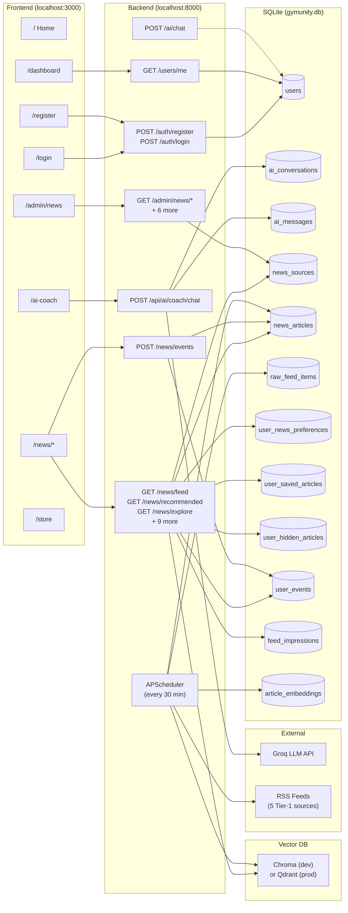

### Config points

| What | Value | Defined in |
|---|---|---|
| Frontend port | `3000` | `vite.config.ts` → `server.port` |
| Backend port | `8000` | CLI: `uvicorn main:app --port 8000` |
| API base URL | `VITE_API_BASE_URL` → `http://localhost:8000` | `.env.local` → `src/lib/api.ts:1` |
| DB path | `sqlite:///./gymunity.db` | `backend/.env` → `app/core/config.py:16` |
| JWT secret | `JWT_SECRET` env var | `backend/.env` → `app/core/security.py:24` |
| Vector DB provider | `VECTOR_DB_PROVIDER` (`none`/`chroma`/`qdrant`) | `backend/.env` → `app/core/config.py:22` |
| Pipeline enabled | `NEWS_PIPELINE_ENABLED` (`true`/`false`) | `backend/.env` → `main.py:51` |

---

# 3) Core Flows (Step-by-Step)

---

## Flow 1: User Registration

### A) Sequence Diagram

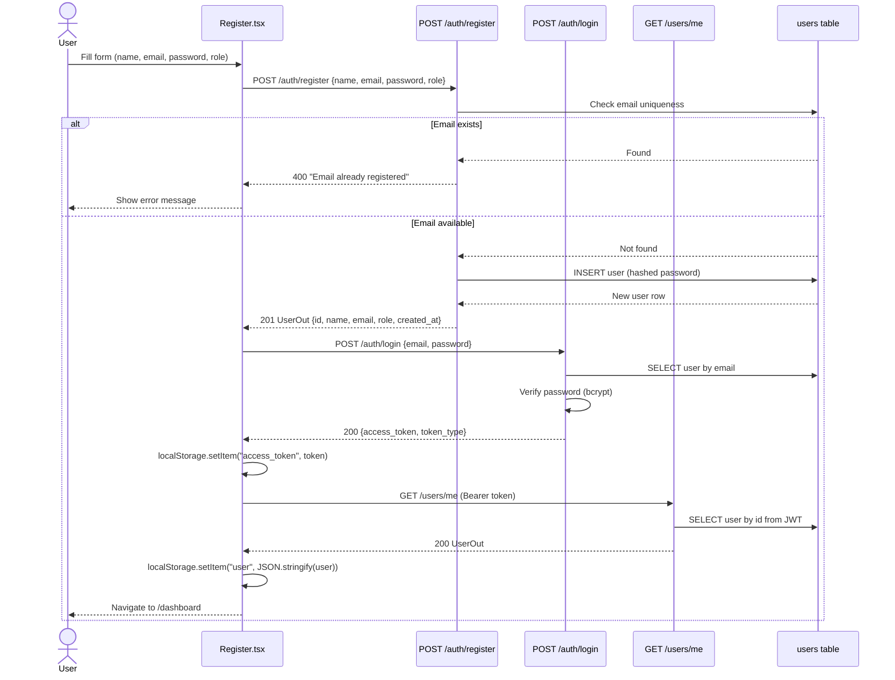

### B) Steps

1. User fills the registration form in `components/Register.tsx`.
2. Component concatenates `firstName` + `lastName` → `name`. Maps role `'member'` → `'user'`.
3. `POST /auth/register` → API validates email format (Pydantic `EmailStr`), password min 6 chars, role in `{user, seller, coach}`. **Note: `admin` role is blocked.**
4. API checks if email exists in `users` table. If yes → `400`.
5. API hashes password with `bcrypt`, creates `User` row, returns `UserOut`.
6. UI immediately calls `POST /auth/login` with same credentials.
7. API creates JWT with `sub=user_id`, `role=user_role`, TTL = 7 days.
8. UI stores `access_token` in `localStorage`.
9. UI calls `GET /users/me` to fetch full user profile.
10. UI stores user JSON in `localStorage` key `"user"`.
11. `App.syncUser()` updates React state. UI navigates to `/dashboard`.

---

## Flow 2: User Login

### A) Sequence Diagram

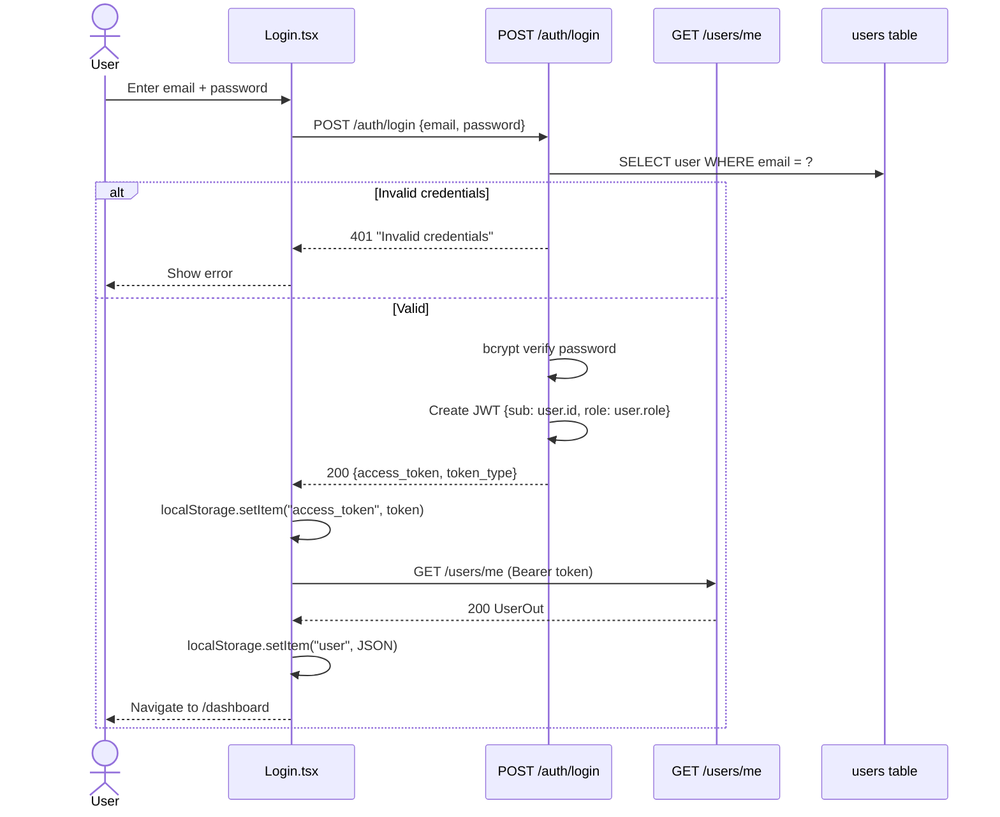

---

## Flow 3: Accessing a Protected Page

### A) Sequence Diagram

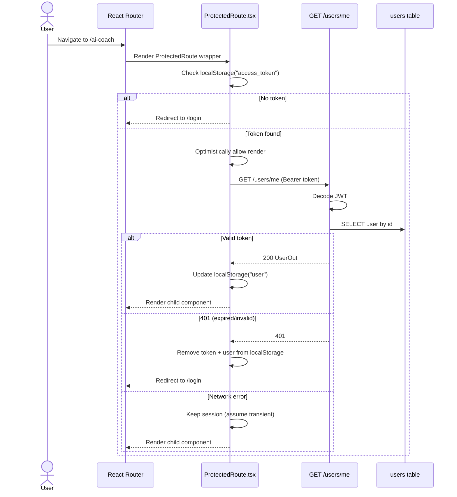

---

## Flow 4: Logout

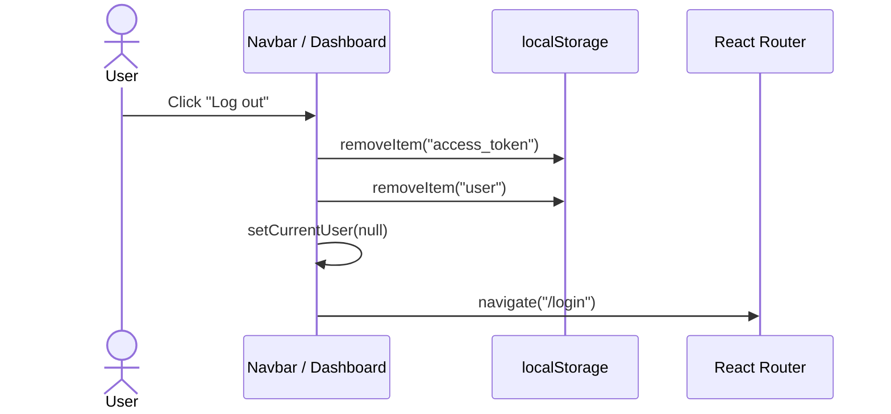

> **Note:** There is NO server-side token invalidation. The JWT remains valid until it expires (7 days).

---

## Flow 5: AI Coach Chat (Main Feature)

### A) Sequence Diagram

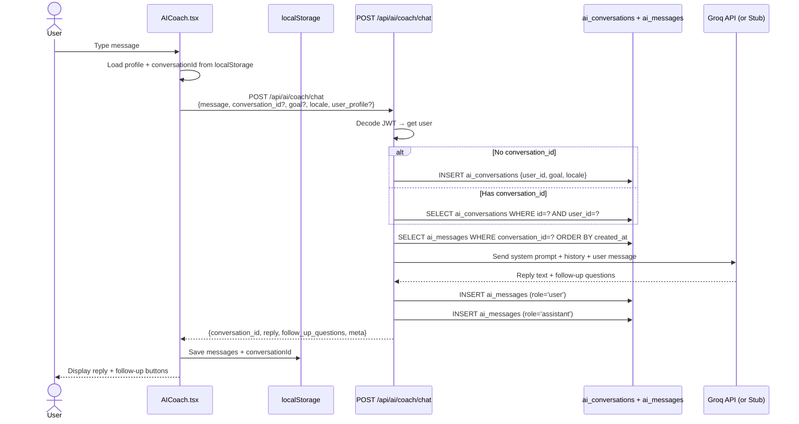

---

## Flow 6: News Feed (Standard SQL-based)

### A) Sequence Diagram

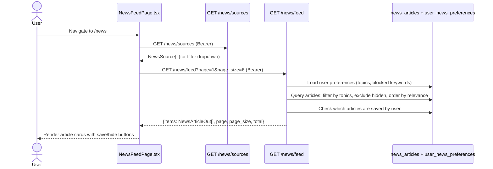

---

## Flow 7: Hybrid Recommended Feed (AI-powered)

### A) Sequence Diagram

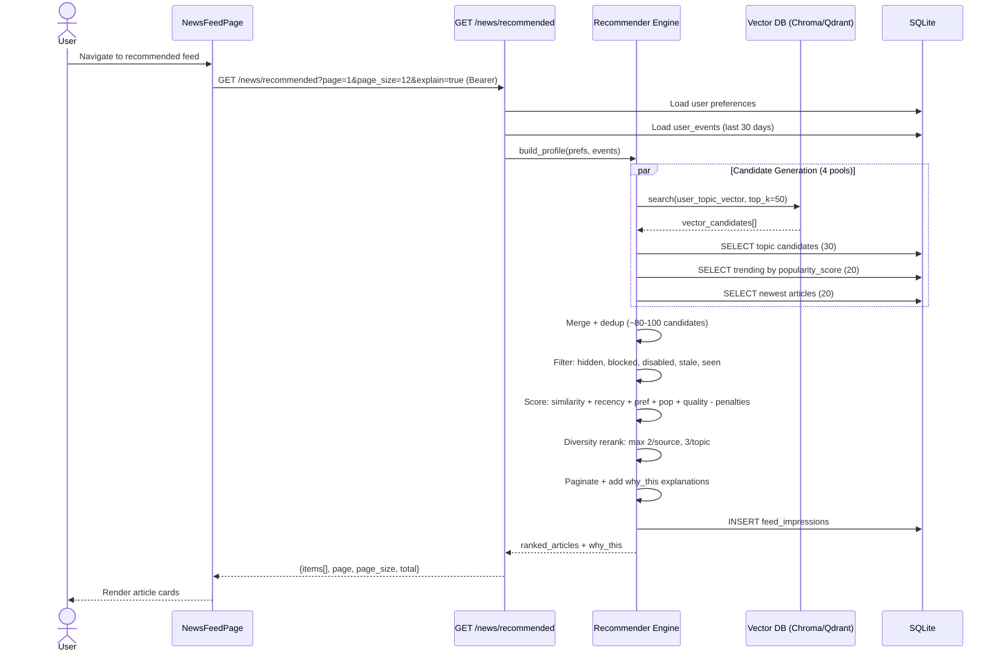

### B) Scoring Formula

```
score = (0.30 × similarity)
      + (0.25 × recency_decay)         # exp(-0.1 × days_old)
      + (0.20 × preference_match)       # 1.0 if topics overlap
      + (0.15 × popularity)             # min(1.0, pop_score / 100)
      + (0.10 × quality_score)          # from enrichment (0.0–1.0)
      - (0.50 × already_seen_penalty)
      - (0.20 × source_fatigue_penalty)
```

### C) Response shape (when `explain=true`)

```json
{
  "items": [
    {
      "id": 42,
      "title": "5 Best Compound Lifts for Strength",
      "why_this": {
        "reasons": ["matched_topic:strength", "freshness_boost", "high_quality"],
        "score": 0.83,
        "pool": "vector"
      }
    }
  ],
  "page": 1, "page_size": 12, "total": 38
}
```

---

## Flow 8: Event Tracking (Feedback Loop)

### A) Sequence Diagram

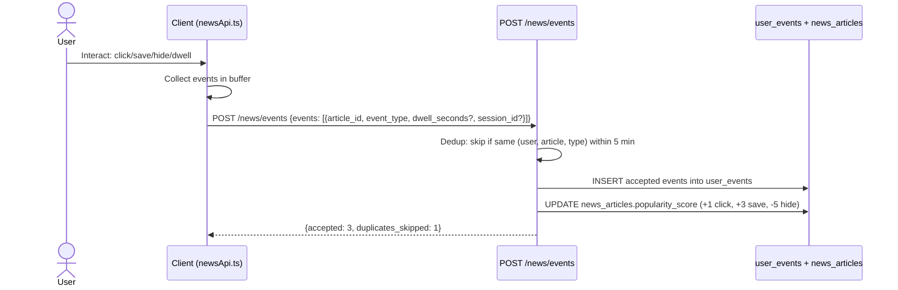

### B) Event types and weights

| Event | Trigger | Popularity weight |
|---|---|---|
| `impression` | Article rendered | — |
| `click` | User clicks article | +1.0 |
| `save` | User saves article | +3.0 |
| `unsave` | User unsaves | -1.0 |
| `hide` | User hides article | -5.0 |
| `unhide` | User unhides (future) | — |
| `dwell` | User spends ≥10s on article | — |

---

## Flow 9: RSS Ingestion Pipeline

### A) Sequence Diagram

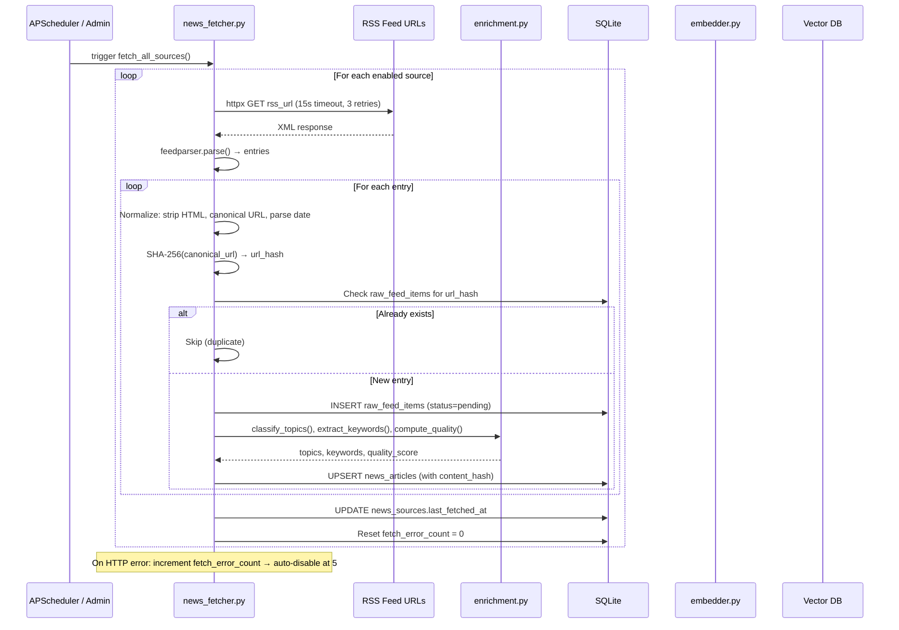

### B) Pipeline stages

| Stage | What happens | Library |
|---|---|---|
| 1. Fetch | HTTP GET with 15s timeout, 3 retries, exponential backoff | `httpx` |
| 2. Parse | Extract entries from RSS/Atom XML | `feedparser` |
| 3. Normalize | Strip HTML, canonical URL (remove tracking params), parse dates | regex + `urllib` |
| 4. Dedup | SHA-256(canonical_url) → check `raw_feed_items` table | `hashlib` |
| 5. Enrich | Topics (rule-based), keywords (frequency), quality (heuristic 0-1) | `enrichment.py` |
| 6. Persist | Upsert `news_articles` with `content_hash` for change detection | SQLAlchemy |
| 7. Embed | Generate 384-dim vector, upsert to vector DB (if enabled) | `sentence-transformers` |

### C) Default RSS sources (5 Tier-1)

| Name | Category |
|---|---|
| Bodybuilding.com Articles | fitness |
| Breaking Muscle | fitness |
| T-Nation | fitness |
| Muscle & Fitness | fitness |
| Men's Health Fitness | fitness |

---

# 4) Frontend Data Flow Rules

## Where API calls happen

| Module | File | Purpose |
|---|---|---|
| Auth API | `src/lib/api.ts` | `register()`, `login()`, `me()` |
| News API | `src/lib/newsApi.ts` | All news + admin + events + recommender endpoints (20+ functions) |
| AI Coach | `src/pages/AICoach.tsx` (inline `fetch`) | Direct `fetch()` to `/api/ai/coach/chat` |

> **Pattern:** No shared hooks or React context for data fetching. Each page calls API functions directly in event handlers or `useEffect`.

## How state is stored

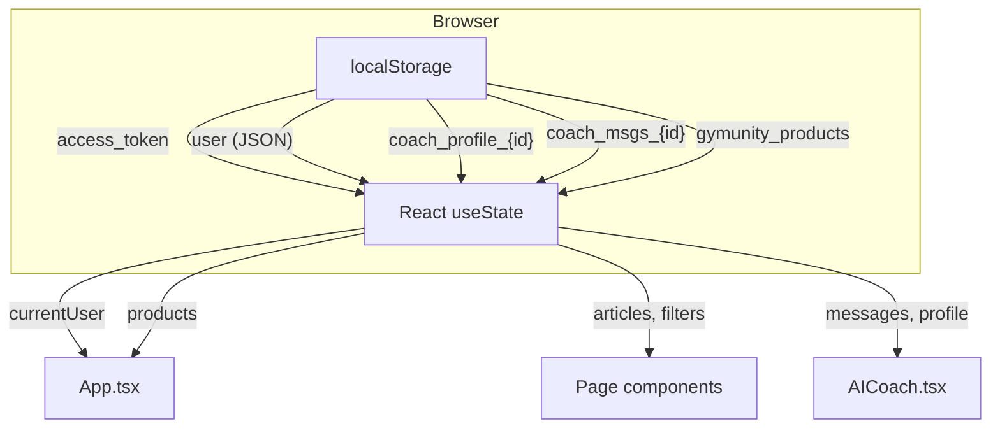

| Data | Storage | Scope |
|---|---|---|
| `access_token` | `localStorage` | Global, persists across refreshes |
| `user` object | `localStorage` + React state in `App.tsx` | Global |
| AI Coach profile | `localStorage` (per user ID) | Per user |
| AI Coach messages | `localStorage` (per user ID) | Per user |
| Products | `localStorage` | Global (no backend) |
| News articles | React state only | Per page, lost on navigation |
| News filters | React state only | Per page session |

## How auth token is attached

```
// src/lib/api.ts — getAuthHeader()
const token = localStorage.getItem('access_token');
return { Authorization: `Bearer ${token}` };
```

- Both `api.ts` and `newsApi.ts` have their **own** `getAuthHeader()` function (duplicated).
- The header is merged into every `fetch()` call via the `request()` wrapper.
- **No Axios interceptors** — it's all plain `fetch()`.

---

# 5) Backend Request Lifecycle

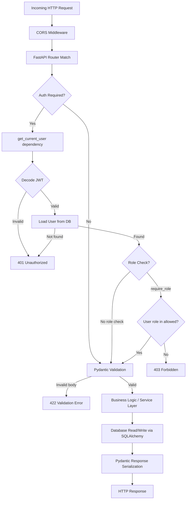

### Dependency injection chain

| Dependency | What it does | File |
|---|---|---|
| `get_db()` | Yields a SQLAlchemy `Session`, closes on finish | `backend/app/api/deps.py` |
| `get_current_user()` | Extracts Bearer token → decodes JWT → loads `User` from DB | `backend/app/api/deps.py` |
| `require_role(roles)` | Wraps `get_current_user` + checks `user.role in roles` | `backend/app/api/deps.py` |

---

# 6) Database Touchpoints

| Table | Create | Read | Update | Delete | Used by |
|---|---|---|---|---|---|
| `users` | Registration | Login, `/users/me`, every auth check | — | — | `auth.py`, `deps.py`, `users.py` |
| `ai_conversations` | First message in a chat | Load conversation for chat | — | — | `ai_coach_v2.py` |
| `ai_messages` | Every chat exchange (2 rows) | Load history for context | — | — | `ai_coach_v2.py` |
| `news_sources` | Admin create, seed on init | Feed/explore, admin list | Admin update/toggle, fetch timestamps, error count | Admin delete | `news.py`, `admin_news.py`, `news_service.py`, `news_fetcher.py` |
| `news_articles` | RSS pipeline ingest, seed on init | Feed/explore/saved/recommended | Popularity score via events, content_hash | Cascade on source delete | `news.py`, `news_service.py`, `recommender.py`, `events.py` |
| `raw_feed_items` | RSS pipeline (dedup staging) | Dedup check during fetch | Status updates | — | `news_fetcher.py` |
| `article_embeddings` | Embedding service | Check staleness | Updated on re-embed | — | `embedder.py` |
| `user_news_preferences` | Auto-created on first access | Feed filtering, recommender profile | Preferences update | — | `news.py`, `news_service.py`, `recommender.py` |
| `user_saved_articles` | Save article | Check saved status in feeds | — | Unsave | `news.py`, `news_service.py`, `recommender.py` |
| `user_hidden_articles` | Hide article | Exclude from feeds + recommender | — | — | `news.py`, `news_service.py`, `recommender.py` |
| `user_events` | POST /news/events batch | Build user profile (affinities) | — | — | `events.py`, `recommender.py` |
| `feed_impressions` | Recommender logs shown articles | Filter recently seen | — | — | `recommender.py` |

---

# 7) "Where Could Things Break?"

| # | Problem | Symptom | Where to check |
|---|---|---|---|
| 1 | **Wrong `VITE_API_BASE_URL`** | All API calls fail | `.env.local`, `src/lib/api.ts:1` |
| 2 | **CORS mismatch** | Browser blocks requests | `backend/.env` `CORS_ORIGINS` |
| 3 | **Token expired** | Protected pages redirect to `/login` | `ACCESS_TOKEN_EXPIRE_MINUTES` in `.env` |
| 4 | **JWT_SECRET mismatch** | All tokens invalid after restart if secret changed | `backend/.env` `JWT_SECRET` |
| 5 | **Missing `GROQ_API_KEY`** | AI Coach uses StubProvider | `backend/.env`, `factory.py` |
| 6 | **RSS source returns 404/500** | fetch_error_count increments; auto-disable at 5 | `news_fetcher.py` |
| 7 | **Vector DB not configured** | Recommended feed uses SQL-only pools (graceful) | `VECTOR_DB_PROVIDER` in `.env` |
| 8 | **Embedding model fails to load** | Vector candidates empty; SQL fallback | `embedder.py`, install `sentence-transformers` |
| 9 | **DB schema drift** | New columns cause errors | Delete `gymunity.db` and restart |
| 10 | **Events batch too large (>100)** | 422 validation error | `schemas/events.py` max_length=100 |
| 11 | **SQLite concurrent writes** | `database is locked` errors under load | Use WAL mode or migrate to Postgres |

---

# 8) Summary (Cheat Sheet)

## Main endpoints

| Endpoint | Purpose |
|---|---|
| `POST /auth/register` | Create account |
| `POST /auth/login` | Get JWT |
| `GET /users/me` | Verify token, get user |
| `POST /api/ai/coach/chat` | AI Coach conversation |
| `GET /news/feed` | SQL-filtered news feed |
| `GET /news/recommended` | Hybrid AI-recommended feed |
| `POST /news/events` | Batch event tracking |
| `GET /admin/news/sources` | Admin: list sources |
| `POST /admin/news/fetch-now` | Admin: trigger RSS pipeline |

## Main UI pages

| Route | Page | Auth |
|---|---|---|
| `/` | Home (landing) | No |
| `/login` | Login form | No |
| `/register` | Registration form | No |
| `/ai-coach` | AI Coach chat | Yes |
| `/news` | News feed | Yes |
| `/admin/news` | Admin panel | Admin |

## Main DB tables (12 total)

| Table | Key data |
|---|---|
| `users` | id, name, email, password_hash, role |
| `ai_conversations` | id (UUID), user_id, goal, locale |
| `ai_messages` | id (UUID), conversation_id, role, content |
| `news_articles` | id, source_id, title, summary, topics_json, quality_score, popularity_score |
| `raw_feed_items` | id, source_id, url_hash, status (pending/processed/duplicate) |
| `article_embeddings` | article_id, content_hash, model_name, vector_id |
| `user_events` | user_id, article_id, event_type, dwell_seconds |
| `feed_impressions` | user_id, article_id, position, feed_type |
| `user_news_preferences` | user_id, topics (CSV), level, equipment |

## Quick test commands

```bash
# Health check
curl http://localhost:8000/health

# Register
curl -X POST http://localhost:8000/auth/register \
  -H "Content-Type: application/json" \
  -d '{"name":"Test User","email":"test@example.com","password":"password123","role":"user"}'

# Login (get token)
TOKEN=$(curl -s -X POST http://localhost:8000/auth/login \
  -H "Content-Type: application/json" \
  -d '{"email":"test@example.com","password":"password123"}' | python -c "import sys,json;print(json.load(sys.stdin)['access_token'])")

# Standard feed
curl "http://localhost:8000/news/feed?page=1&page_size=3" \
  -H "Authorization: Bearer $TOKEN"

# Hybrid recommended feed with explanations
curl "http://localhost:8000/news/recommended?page=1&page_size=6&explain=true" \
  -H "Authorization: Bearer $TOKEN"

# Send events
curl -X POST http://localhost:8000/news/events \
  -H "Content-Type: application/json" \
  -H "Authorization: Bearer $TOKEN" \
  -d '{"events":[{"article_id":1,"event_type":"click"}]}'
```
