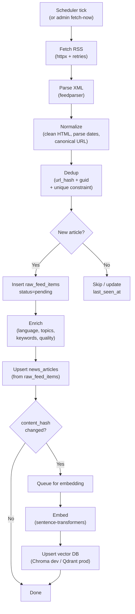
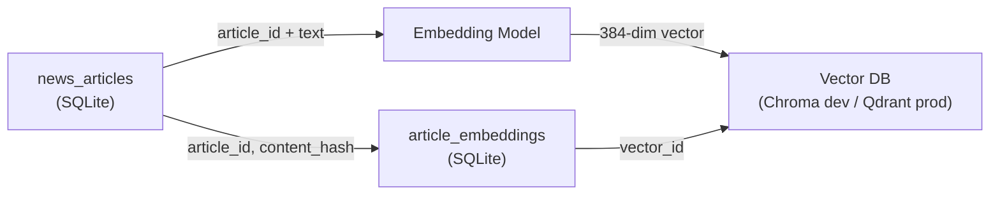
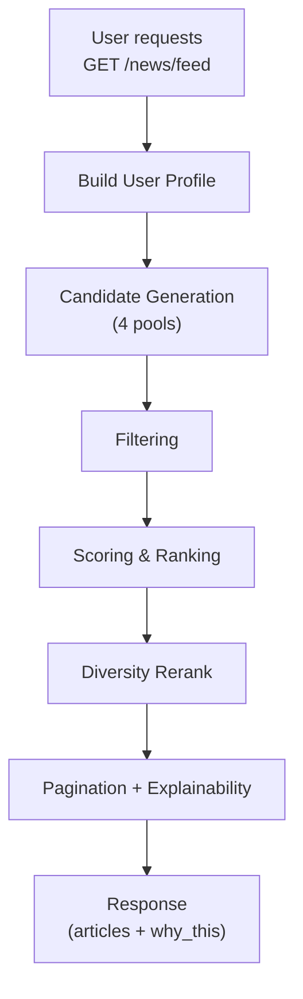
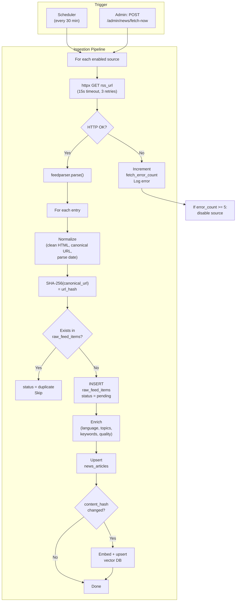
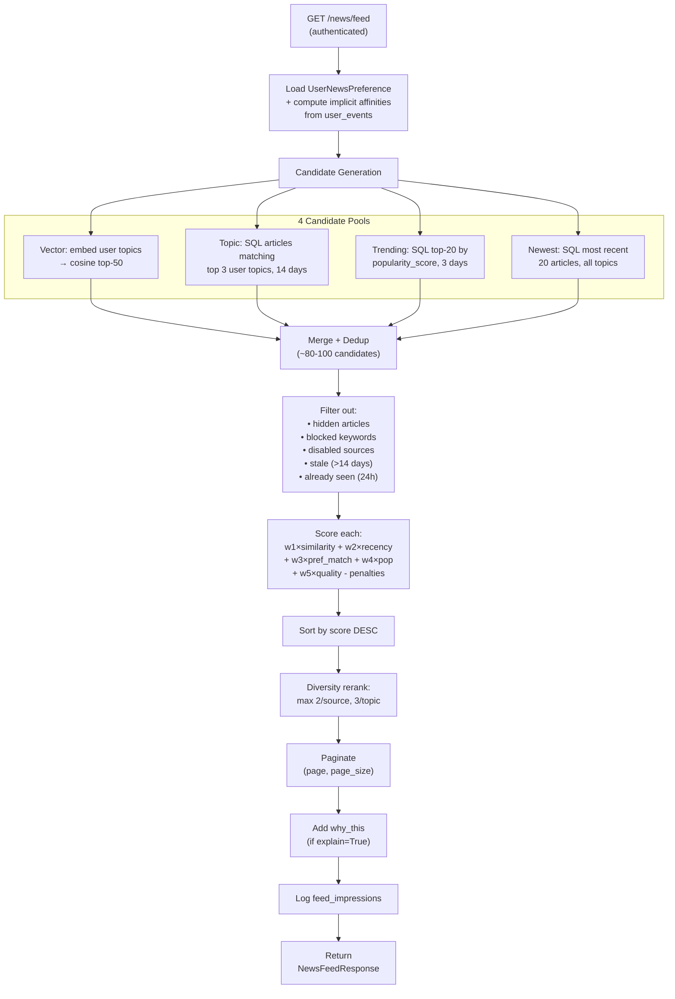
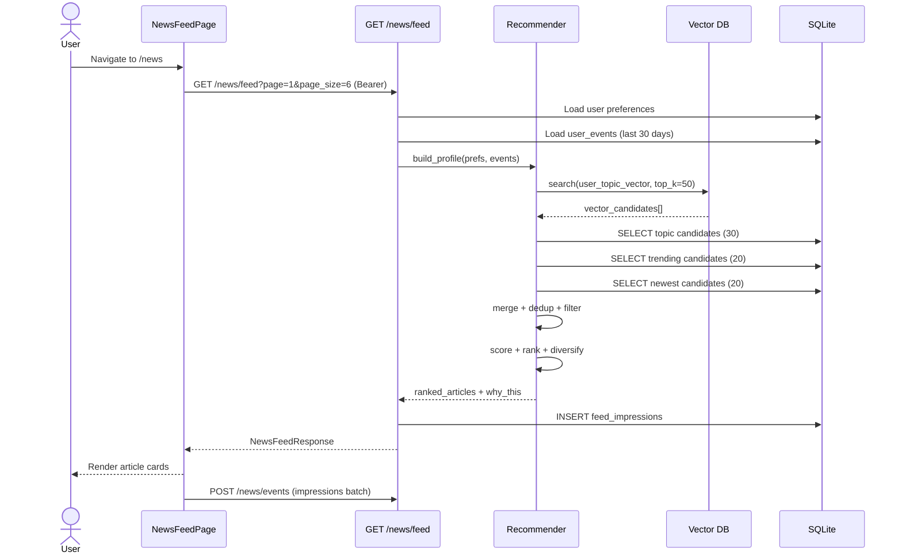

# GymUnity — NEWS_RECOMMENDER_DESIGN.md

> Production-grade News Recommendation System design. Every reference is traced to code; unconfirmed items are labelled.

---

# Implementation Status (as of 2026-02-24)

> [!IMPORTANT]
> **All 4 phases are implemented.** The recommender system is fully operational. This document now serves as both the design specification and the implementation record.

| Phase | Scope | Status | Key files |
|---|---|---|---|
| **Phase 0** | Security fixes (admin role, .env) | ✅ Complete | `auth.py`, `.gitignore` |
| **Phase 1** | Data model + RSS ingestion pipeline | ✅ Complete | `models/news.py`, `news_fetcher.py`, `enrichment.py`, `default_news_sources.py`, `init_db.py` |
| **Phase 2** | Embeddings + vector search | ✅ Complete | `vector_store.py`, `embedder.py`, `config.py` |
| **Phase 3** | Hybrid ranker + events + explainability | ✅ Complete | `recommender.py`, `events.py`, `schemas/events.py`, `news.py`, `newsApi.ts` |
| **Phase 4** | Scheduler wiring + verification | ✅ Complete | `main.py`, `news_scheduler.py`, `smoke_test.py` |

### What remains unimplemented from original design

| Feature | Design section | Status | Notes |
|---|---|---|---|
| Frontend event emission in pages | Phase 3, §3.10 | ⚠️ Partial | `sendEvents()` API exists; pages don't auto-emit yet |
| `why_this` tooltip in UI | Phase 3, §3.10 | ❌ Not started | Backend returns data; frontend doesn't display it |
| Debug endpoint `/news/debug/profile` | Phase 4, §4.3 | ❌ Not started | |
| Evaluation script `evaluate.py` | Phase 4, §4.2 | ❌ Not started | |
| Admin pipeline metrics dashboard | Phase 4, §4.4 | ❌ Not started | |
| Alembic migrations | Migration plan | ❌ Not configured | Using manual `ALTER TABLE` in `init_db.py` |

---

# 1) Goals & Non-Goals

## Goals

| Requirement | Target |
|---|---|
| **Freshness** | Articles ≤ 7 days shown by default; recency decay in ranking |
| **Relevance** | Feed matches user topics, level, implicit behaviour |
| **Diversity** | Max 2 articles per source per page; max 3 per topic cluster |
| **Safety** | Blocked keywords filtered; HTML sanitised on ingest; admin-only source management |
| **Speed** | Feed response < 500 ms (SQLite dev); < 200 ms (Postgres+cache prod) |
| **Explainability** | Every article includes `why_this` reasons the user can inspect |

## Non-Goals

- Heavy ML model training (use deterministic scores + embedding similarity)
- Real-time push notifications
- NLP entity extraction beyond keyword/topic classification
- Multi-language NLP (English-only articles; UI remains bilingual)
- Social features (comments, shares)

---

# 2) Data Model Updates

## New tables

### `raw_feed_items` — staging area for fetched RSS entries

```
raw_feed_items
├── id              INTEGER  PK
├── source_id       INTEGER  FK → news_sources.id, indexed
├── guid            TEXT     (from RSS <guid>)
├── url             TEXT     NOT NULL
├── url_hash        TEXT     NOT NULL (SHA-256 of canonical URL)
├── title_raw       TEXT
├── summary_raw     TEXT
├── content_raw     TEXT
├── author_raw      TEXT
├── image_url_raw   TEXT
├── published_raw   TEXT     (original string from RSS)
├── fetched_at      DATETIME NOT NULL default utcnow
├── status          TEXT     default 'pending'  (pending|processed|error|duplicate)
├── error_message   TEXT     nullable
└── INDEX ix_raw_source_url  (source_id, url_hash) UNIQUE
```

**Why:** Decouples fetch from processing. If enrichment fails, raw data is preserved. Enables replay.

### `article_embeddings` — vector pointers stored in relational DB

```
article_embeddings
├── id              INTEGER  PK
├── article_id      INTEGER  FK → news_articles.id, UNIQUE, indexed
├── content_hash    TEXT     NOT NULL (SHA-256 of embedded text)
├── model_name      TEXT     NOT NULL
├── dimensions      INTEGER  NOT NULL
├── vector_id       TEXT     NOT NULL (ID used in vector DB)
├── created_at      DATETIME NOT NULL
└── updated_at      DATETIME
```

**Why:** The actual vector lives in Chroma/Qdrant. This table tracks *which* articles are embedded and detects when re-embedding is needed (content_hash changed).

### `user_events` — feedback loop

```
user_events
├── id              INTEGER  PK
├── user_id         INTEGER  FK → users.id, indexed
├── article_id      INTEGER  FK → news_articles.id, indexed
├── event_type      TEXT     NOT NULL (impression|click|save|unsave|hide|unhide|dwell)
├── dwell_seconds   REAL     nullable (only for dwell events)
├── session_id      TEXT     nullable (client-generated UUID)
├── created_at      DATETIME NOT NULL default utcnow
└── INDEX ix_user_events_user_type  (user_id, event_type)
└── INDEX ix_user_events_article    (article_id, event_type)
```

### `feed_impressions` — tracks what was shown

```
feed_impressions
├── id              INTEGER  PK
├── user_id         INTEGER  FK → users.id, indexed
├── article_id      INTEGER  FK → news_articles.id
├── position        INTEGER  NOT NULL (0-indexed rank in feed)
├── feed_type       TEXT     NOT NULL (feed|explore|saved)
├── created_at      DATETIME NOT NULL
└── INDEX ix_impressions_user_time (user_id, created_at)
```

## Columns to ADD to existing tables

### `news_articles` — add these columns

| Column | Type | Why |
|---|---|---|
| `language` | `String`, default `'en'` | Language detection result |
| `topics_json` | `Text`, default `'[]'` | JSON array of classified topics |
| `keywords_json` | `Text`, default `'[]'` | JSON array of extracted keywords |
| `quality_score` | `Float`, default `0.5` | Heuristic quality (title length, has summary, has image, etc.) |
| `popularity_score` | `Float`, default `0.0` | Aggregated from user events (clicks, saves, impressions) |
| `content_hash` | `String`, nullable | SHA-256 of `title+summary+content`; triggers re-embed if changed |

> **File:** `backend/app/models/news.py` — `NewsArticle` class, lines 24–48

### `news_sources` — add column

| Column | Type | Why |
|---|---|---|
| `priority` | `Integer`, default `1` | Source quality tier (1=best). Used in ranking |
| `fetch_error_count` | `Integer`, default `0` | Consecutive failures. Source auto-disabled at 5 |
| `last_error` | `Text`, nullable | Last error message |

> **File:** `backend/app/models/news.py` — `NewsSource` class, lines 9–21

## Tags storage: CSV → keep CSV, add JSON columns

The existing `tags` column in `news_articles` and `news_sources` uses CSV strings. The service layer already has `_split_csv()` / `_list_to_csv()` helpers in `backend/app/services/news_service.py:39-51`. **Keep CSV for `tags` for backwards compatibility.** Use JSON for the new `topics_json` and `keywords_json` columns (parsed with `json.loads()`).

## Migration strategy

**Dev (SQLite):** Use Alembic with `batch` mode (required for SQLite ALTER TABLE limitations).

```bash
cd backend
pip install alembic
alembic init alembic
# Edit alembic/env.py → set target_metadata = Base.metadata
# Edit alembic.ini → set sqlalchemy.url = sqlite:///./gymunity.db
alembic revision --autogenerate -m "add_recommender_tables"
alembic upgrade head
```

**Fallback (no Alembic):** Add columns via raw SQL in `init_db.py`:

```python
# After create_all():
with engine.connect() as conn:
    for col, sql in [
        ('language', "ALTER TABLE news_articles ADD COLUMN language TEXT DEFAULT 'en'"),
        ('topics_json', "ALTER TABLE news_articles ADD COLUMN topics_json TEXT DEFAULT '[]'"),
        # ... etc
    ]:
        try:
            conn.execute(text(sql))
            conn.commit()
        except OperationalError:
            pass  # Column already exists
```

---

# 3) Ingestion Pipeline (RSS → Articles DB)

## Pipeline stages



## Stage details

### Stage 1 — Fetch

- **Library:** `httpx` (already in `requirements.txt`)
- **Timeout:** 15s connect, 30s read
- **Retries:** 3 with exponential backoff (1s, 2s, 4s)
- **Rate limit:** max 2 concurrent fetches, 1s delay between sources
- **Error handling:** On failure, increment `news_sources.fetch_error_count`. At 5 consecutive failures, set `enabled=False` and log warning. Admin can re-enable.
- **File to modify:** Replace stub in `backend/app/services/news_fetcher.py` (currently 22 lines, does nothing)

### Stage 2 — Parse & Normalize

- **Library:** `feedparser` (add to `requirements.txt`)
- **Clean HTML:** `bleach.clean()` or regex strip tags from `summary`/`content`
- **Parse dates:** `feedparser` provides `published_parsed`; fallback to `dateutil.parser.parse()`
- **Canonical URL:** Strip query params (`utm_*`, tracking params), normalize scheme to https
- **Truncation:** `summary` max 2000 chars, `content` max 50000 chars

### Stage 3 — Dedup

- **Primary key:** `SHA-256(canonical_url)` → stored as `url_hash` in `raw_feed_items`
- **Existing constraint:** `news_articles` already has `ix_news_article_source_unique` on `(source_id, unique_hash)` — re-use `unique_hash` as the same `SHA-256(canonical_url)`
- **Similarity fallback:** If title similarity > 90% (Jaccard on word set) and same source, treat as duplicate
- **On duplicate:** Update `status='duplicate'` in `raw_feed_items`, skip

### Stage 4 — Enrich

- **Language detection:** `langdetect` library (lightweight, no GPU). Store in `news_articles.language`
- **Topic classification (rule-based baseline):**

```python
TOPIC_RULES = {
    'strength':    ['strength', 'powerlifting', 'deadlift', 'squat', 'bench press'],
    'nutrition':   ['nutrition', 'diet', 'protein', 'calories', 'meal'],
    'cardio':      ['cardio', 'running', 'hiit', 'endurance', 'aerobic'],
    'recovery':    ['recovery', 'sleep', 'rest', 'stretching', 'foam roll'],
    'bodybuilding':['bodybuilding', 'hypertrophy', 'muscle', 'bulk', 'cut'],
    'weight_loss': ['weight loss', 'fat loss', 'lean', 'deficit', 'calorie'],
    'mental':      ['mental', 'mindset', 'motivation', 'stress', 'anxiety'],
    'injury':      ['injury', 'rehab', 'pain', 'prevention', 'physical therapy'],
}

def classify_topics(title: str, summary: str) -> list[str]:
    text = f"{title} {summary}".lower()
    return [topic for topic, keywords in TOPIC_RULES.items()
            if any(kw in text for kw in keywords)]
```

- **Keyword extraction:** Top 10 TF-IDF terms from title+summary (use `sklearn.feature_extraction.text.TfidfVectorizer` or simple word frequency)
- **Quality score:** Heuristic 0.0–1.0:

```python
score = 0.0
if len(title) > 20: score += 0.2
if len(summary) > 100: score += 0.2
if image_url: score += 0.2
if content and len(content) > 500: score += 0.2
if published_at and (now - published_at).days < 3: score += 0.2
```

- **New file:** `backend/app/services/enrichment.py`

### Stage 5 — Persist

- Upsert from `raw_feed_items` (status=pending) → `news_articles`
- Compute `content_hash = SHA-256(title + summary + (content or ''))`
- If article already exists and `content_hash` matches → skip
- If `content_hash` differs → update article, mark for re-embedding

### Stage 6 — Embed (async, separate pass)

- See Section 4

## Observability

- Update `news_sources.last_fetched_at` after each source fetch
- Reset `fetch_error_count` to 0 on success
- Log: `source_name, articles_found, articles_new, articles_skipped, duration_ms`
- The `NEWS_STATUS` dict in `news_service.py:29-36` becomes a proper DB-backed status table (or keep in-memory for dev)

---

# 4) Embeddings & Vector Index

## What text is embedded

```python
embed_text = f"{article.title}. {article.summary}"
if article.content:
    embed_text += f" {article.content[:2000]}"
```

Truncate total to 512 tokens (model limit for `all-MiniLM-L6-v2`).

## Embedding model

| Setting | Value |
|---|---|
| Model | `sentence-transformers/all-MiniLM-L6-v2` (already in `config.py:24`) |
| Dimensions | 384 |
| Speed | ~4000 sentences/sec on CPU |
| Install | `pip install sentence-transformers` |

## Storage architecture



- **`article_embeddings`** table tracks which articles are embedded and detects staleness via `content_hash`.
- The vector itself lives in the external vector DB, keyed by `vector_id` (= `str(article_id)`).
- Metadata stored in vector DB per point: `{article_id, source_id, topics, published_at, language}`.

## Update strategy

1. On ingest: new articles get `content_hash` computed, no embedding row yet.
2. Background task (or on-demand): query `news_articles LEFT JOIN article_embeddings` where embedding is NULL or `content_hash` differs.
3. Embed batch (up to 100 at a time), upsert vector DB, upsert `article_embeddings`.
4. **Never re-embed unchanged articles.**

## Dev plan: ChromaDB

```python
# backend/app/services/vector_store.py
import chromadb

client = chromadb.PersistentClient(path="./data/chroma")
collection = client.get_or_create_collection(
    name="gymunity-news",
    metadata={"hnsw:space": "cosine"}
)
```

- Add `chromadb` to `requirements.txt`.
- Config: `VECTOR_DB_PROVIDER=chroma` (new env var), `VECTOR_DB_PATH=./data/chroma`.

## Prod plan: Qdrant

```python
from qdrant_client import QdrantClient
from qdrant_client.models import Distance, VectorParams

client = QdrantClient(url=settings.VECTOR_DB_URL)
client.recreate_collection(
    collection_name="gymunity-news",
    vectors_config=VectorParams(size=384, distance=Distance.COSINE),
)
```

- Config already exists: `VECTOR_DB_URL=http://localhost:6333` in `config.py:21`.

## Abstraction layer

Create `backend/app/services/vector_store.py` with interface:

```python
class VectorStore(ABC):
    def upsert(self, ids: list[str], embeddings: list[list[float]], metadata: list[dict]) -> None: ...
    def search(self, query_vector: list[float], top_k: int, filters: dict | None) -> list[dict]: ...
    def delete(self, ids: list[str]) -> None: ...

class ChromaVectorStore(VectorStore): ...  # dev
class QdrantVectorStore(VectorStore): ...  # prod
```

Factory function reads `settings.VECTOR_DB_PROVIDER` (`chroma` | `qdrant`).

---

# 5) Recommendation Serving (User → Feed)

## Overview



## A) User profile building

```python
@dataclass
class UserProfile:
    # Explicit (from user_news_preferences)
    topics: list[str]       # e.g. ['strength', 'nutrition']
    level: str              # 'beginner' | 'intermediate' | 'advanced'
    equipment: str           # 'gym' | 'home' | 'both'
    blocked_keywords: list[str]

    # Implicit (computed from user_events, last 30 days)
    topic_affinities: dict[str, float]   # topic → affinity score (0-1)
    source_affinities: dict[int, float]  # source_id → affinity score
    avg_dwell_seconds: float
    save_rate: float          # saves / impressions
    recent_article_ids: set[int]  # last 100 interacted articles
```

**Implicit signal weights:**

| Event | Weight |
|---|---|
| `impression` (no click) | −0.1 |
| `click` | +0.3 |
| `save` | +1.0 |
| `unsave` | −0.5 |
| `hide` | −2.0 |
| `dwell > 30s` | +0.5 |
| `dwell > 60s` | +1.0 |

Aggregate per topic: sum of weighted events for articles with that topic, normalized to [0,1].

## B) Candidate generation — 4 pools

| Pool | Source | Size | Fallback? |
|---|---|---|---|
| **Vector** | Embed user profile (topic keywords) → vector search top-K | 50 | If vector DB empty → skip |
| **Topic** | SQL: articles matching user's top 3 topics, last 14 days | 30 | Always available |
| **Trending** | SQL: articles with highest `popularity_score`, last 3 days | 20 | Always available |
| **Newest** | SQL: most recent articles, no topic filter | 20 | Always available |

Merge all pools → deduplicate by `article_id` → ~80-100 candidates.

## C) Filtering

Remove candidates that match ANY of:
1. `article_id` in `user_hidden_articles`
2. `article_id` in `feed_impressions` for this user in last 24h (already seen)
3. Any `blocked_keywords` match in title or summary
4. `source.enabled == False`
5. `article.language` ≠ user's language preference (default: `'en'`)
6. `article.published_at` older than `freshness_window` (default 14 days, configurable)

## D) Ranking formula

```
score = (w1 × similarity)
      + (w2 × recency_decay)
      + (w3 × preference_match)
      + (w4 × popularity)
      + (w5 × quality_score)
      - (p1 × already_seen_penalty)
      - (p2 × source_fatigue_penalty)
```

**Default weights:**

| Weight | Name | Value | Tuning guidance |
|---|---|---|---|
| `w1` | `similarity` | 0.30 | Increase if user engagement with topic-matched articles is high |
| `w2` | `recency_decay` | 0.25 | `exp(-0.1 × days_old)` — newer articles score higher |
| `w3` | `preference_match` | 0.20 | 1.0 if article topics overlap user topics, else 0.0 |
| `w4` | `popularity` | 0.15 | `min(1.0, popularity_score / 100)` — normalized |
| `w5` | `quality_score` | 0.10 | From enrichment step (0.0–1.0) |
| `p1` | `already_seen` | 0.50 | If article was in impressions in last 7 days |
| `p2` | `source_fatigue` | 0.20 | If user saw 3+ articles from same source in last feed |

## E) Diversity rerank

After sorting by `score` descending, apply greedy diversification:

```python
def diversify(ranked: list[Article], max_per_source=2, max_per_topic=3) -> list[Article]:
    result = []
    source_count = Counter()
    topic_count = Counter()
    for article in ranked:
        if source_count[article.source_id] >= max_per_source:
            continue
        primary_topic = article.topics[0] if article.topics else 'general'
        if topic_count[primary_topic] >= max_per_topic:
            continue
        result.append(article)
        source_count[article.source_id] += 1
        topic_count[primary_topic] += 1
        if len(result) >= page_size:
            break
    return result
```

## F) Explainability — `why_this` field

Each article in the response includes:

```json
{
  "why_this": {
    "reasons": ["matched_topic:strength", "freshness_boost", "high_quality"],
    "score": 0.83,
    "pool": "vector"
  }
}
```

**New file:** `backend/app/services/recommender.py` (~300 lines)
**Modify:** `backend/app/services/news_service.py` — `get_feed()` calls recommender instead of raw SQL query.

---

# 6) Feedback Loop & Events

## `user_events` table usage

The UI emits events for every meaningful user interaction. Events are batched client-side and sent periodically.

### Event types

| Event | Trigger | Extra data |
|---|---|---|
| `impression` | Article rendered in viewport for ≥ 1s | `position` in feed |
| `click` | User clicks article card | — |
| `save` | User saves article | — |
| `unsave` | User unsaves article | — |
| `hide` | User hides article | — |
| `unhide` | User unhides article (future) | — |
| `dwell` | User spends ≥ 10s on article page | `dwell_seconds` |

### Frontend integration

Add to `src/lib/newsApi.ts`:

```typescript
interface UserEvent {
  article_id: number;
  event_type: 'impression' | 'click' | 'save' | 'unsave' | 'hide' | 'dwell';
  dwell_seconds?: number;
  session_id?: string;
}

export const sendEvents = (events: UserEvent[]) =>
  request<{ accepted: number }>('/news/events', {
    method: 'POST',
    body: JSON.stringify({ events }),
  });
```

**Client-side batching:** Collect events in a `Map<article_id, Event[]>` buffer. Flush every 5 seconds or on `beforeunload`.

### How events update the system

1. **Popularity score** (near-real-time): On each batch of events, update `news_articles.popularity_score`:
   ```
   popularity_score += (clicks × 1.0) + (saves × 3.0) - (hides × 5.0)
   ```
2. **User profile affinities** (computed on feed request): Query `user_events` for last 30 days, group by article topics, apply signal weights from Section 5A.
3. **Dedup by session:** Same `(user_id, article_id, event_type, session_id)` within 5 minutes → ignore duplicate.

### File changes

- **[NEW]** `backend/app/api/routes/events.py` — `POST /news/events`
- **[MODIFY]** `backend/main.py` — include events router
- **[MODIFY]** `src/lib/newsApi.ts` — add `sendEvents()`
- **[MODIFY]** `src/pages/NewsFeedPage.tsx` — emit impression/click events
- **[MODIFY]** `src/pages/NewsArticlePage.tsx` — emit dwell events

---

# 7) API Endpoints (FastAPI)

## New endpoints

### `POST /news/events` — batch event ingestion

**Auth:** Bearer token required.

```python
# Request
class EventItem(BaseModel):
    article_id: int
    event_type: Literal['impression', 'click', 'save', 'unsave', 'hide', 'dwell']
    dwell_seconds: float | None = None
    session_id: str | None = None

class EventBatch(BaseModel):
    events: list[EventItem] = Field(..., max_length=100)

# Response
class EventBatchResponse(BaseModel):
    accepted: int
    duplicates_skipped: int
```

**Rate limit suggestion:** Max 100 events per request, max 10 requests/minute per user.

### `GET /news/feed` — MODIFIED for hybrid recommender

Existing endpoint in `backend/app/api/routes/news.py:41-53`. Changes:

**New query params:**
- `explain: bool = False` — include `why_this` in response

**New response schema fields in `NewsArticleOut`:**

```python
class WhyThis(BaseModel):
    reasons: list[str]     # e.g. ["matched_topic:strength", "freshness_boost"]
    score: float           # 0.0 – 1.0
    pool: str              # "vector" | "topic" | "trending" | "newest"

class NewsArticleOut(BaseModel):
    # ... existing fields ...
    why_this: WhyThis | None = None  # Only when explain=True
```

**Backwards compatible:** `why_this` is `None` by default. Old clients unaffected.

### `GET /news/explore` — unchanged logic

Keep as-is. Explore ignores user preferences (no hybrid ranking), just shows latest articles from all sources with basic filters.

### Admin endpoints — minor changes

**`POST /admin/news/fetch-now`** — MODIFIED: Actually triggers RSS ingestion pipeline instead of just updating timestamps. Returns real `FetchNowResponse` with actual counts.

**`GET /admin/news/status`** — MODIFIED: Returns status from actual pipeline runs, not in-memory stub.

## Existing endpoints that hook into events automatically

Existing save/unsave/hide endpoints in `news.py` should **also** write to `user_events` table for the feedback loop. Add a single helper:

```python
def _log_event(db: Session, user_id: int, article_id: int, event_type: str):
    db.add(UserEvent(user_id=user_id, article_id=article_id, event_type=event_type))
    db.commit()
```

Call from `save_article()`, `unsave_article()`, `hide_article()` in `news_service.py`.

---

# 8) Diagrams

## Ingestion flowchart



## Serving flowchart



## Sequence diagram: User opens feed



---

# 9) Implementation Plan (Phased)

## Phase 0 — Security hardening (Days 1–2) ✅ COMPLETE

| # | Change | File | What |
|---|---|---|---|
| 0.1 | Remove `'admin'` from `ALLOWED_ROLES` | `backend/app/api/routes/auth.py:12` | Change `{'user', 'seller', 'coach', 'admin'}` → `{'user', 'seller', 'coach'}` |
| 0.2 | Add `backend/.env` to `.gitignore` | `.gitignore` | Add line: `backend/.env` |
| 0.3 | Rotate Groq API key | `backend/.env` | Generate new key from Groq dashboard |
| 0.4 | Set strong JWT secret | `backend/.env` | `JWT_SECRET=$(python -c "import secrets;print(secrets.token_urlsafe(32))")` |

**Smoke test:**
```bash
# Should fail with 400 "Invalid role"
curl -X POST http://localhost:8000/auth/register \
  -H "Content-Type: application/json" \
  -d '{"name":"Hack","email":"hack@test.com","password":"123456","role":"admin"}'
```

## Phase 1 — Real RSS ingestion + default sources (Days 2–5)

### Patch plan (exact order)

| # | Action | File | Details |
|---|---|---|---|
| 1.1 | **[NEW]** Default sources | `backend/app/services/default_news_sources.py` | 5 Tier-1 sources (see below) |
| 1.2 | **[NEW]** Raw feed items model | `backend/app/models/news.py` | Add `RawFeedItem` class |
| 1.3 | **[MODIFY]** NewsSource model | `backend/app/models/news.py` | Add `priority`, `fetch_error_count`, `last_error` columns |
| 1.4 | **[MODIFY]** NewsArticle model | `backend/app/models/news.py` | Add `language`, `topics_json`, `keywords_json`, `quality_score`, `popularity_score`, `content_hash` |
| 1.5 | **[MODIFY]** init_db.py | `backend/app/db/init_db.py` | Import new models, seed from `default_news_sources.py` |
| 1.6 | **[NEW]** Enrichment service | `backend/app/services/enrichment.py` | Topic rules, quality score, keyword extraction |
| 1.7 | **[MODIFY]** news_fetcher.py | `backend/app/services/news_fetcher.py` | Real RSS fetch with httpx + feedparser + normalize + dedup + enrich |
| 1.8 | **[MODIFY]** news_scheduler.py | `backend/app/services/news_scheduler.py` | Wire to real fetcher |
| 1.9 | **[MODIFY]** main.py | `backend/main.py` | Start scheduler on startup if `NEWS_PIPELINE_ENABLED=true` |
| 1.10 | **[MODIFY]** requirements.txt | `backend/requirements.txt` | Add: `feedparser`, `bleach`, `langdetect`, `apscheduler` |
| 1.11 | **[MODIFY]** admin_news fetch-now | `backend/app/services/news_service.py:460-487` | Call real pipeline instead of updating timestamps |

### Default RSS sources (MANDATORY)

File: `backend/app/services/default_news_sources.py`

```python
DEFAULT_NEWS_SOURCES = [
    {"name": "Muscle & Fitness", "rss_url": "https://www.muscleandfitness.com/feed/",
     "category": "fitness", "tags": ["strength", "workout", "bodybuilding"], "priority": 1, "enabled": True},
    {"name": "Breaking Muscle", "rss_url": "https://breakingmuscle.com/feed/",
     "category": "fitness", "tags": ["strength", "training", "science"], "priority": 1, "enabled": True},
    {"name": "T-Nation", "rss_url": "https://www.t-nation.com/feed/",
     "category": "fitness", "tags": ["bodybuilding", "strength", "performance"], "priority": 1, "enabled": True},
    {"name": "Bodybuilding.com Articles", "rss_url": "https://www.bodybuilding.com/rss/articles",
     "category": "fitness", "tags": ["bodybuilding", "nutrition", "training"], "priority": 1, "enabled": True},
    {"name": "Men's Health Fitness", "rss_url": "https://www.menshealth.com/rss/all.xml/",
     "category": "fitness", "tags": ["fitness", "health", "training"], "priority": 1, "enabled": True},
]
```

**Seeding logic** (in `init_db.py`):
```python
def seed_default_sources(db: Session):
    for src in DEFAULT_NEWS_SOURCES:
        exists = db.query(NewsSource).filter(NewsSource.rss_url == src['rss_url']).first()
        if not exists:
            db.add(NewsSource(
                name=src['name'], rss_url=src['rss_url'], category=src['category'],
                tags=','.join(src['tags']), priority=src.get('priority', 1), enabled=src['enabled'],
            ))
    db.commit()
```

Idempotent: checks `rss_url` uniqueness. Does NOT touch admin-created sources.

**Smoke tests:**
```bash
# Health check
curl http://localhost:8000/health

# Login as admin (create one via script first)
TOKEN=$(curl -s -X POST http://localhost:8000/auth/login \
  -H "Content-Type: application/json" \
  -d '{"email":"admin@gym.com","password":"admin123"}' | python -c "import sys,json;print(json.load(sys.stdin)['access_token'])")

# Trigger real fetch
curl -X POST http://localhost:8000/admin/news/fetch-now \
  -H "Authorization: Bearer $TOKEN"

# Check status
curl http://localhost:8000/admin/news/status \
  -H "Authorization: Bearer $TOKEN"

# Check articles exist
curl "http://localhost:8000/news/feed?page=1&page_size=3" \
  -H "Authorization: Bearer $TOKEN"
```

**Rollback:** Set `NEWS_PIPELINE_ENABLED=false` in `.env`. Scheduler won't start. Admin fetch-now can be reverted by restoring old `news_service.py:460-487`.

## Phase 2 — Embeddings + vector search (Days 6–9) ✅ COMPLETE

| # | Action | File |
|---|---|---|
| 2.1 | **[NEW]** ArticleEmbedding model | `backend/app/models/news.py` |
| 2.2 | **[NEW]** Vector store abstraction | `backend/app/services/vector_store.py` |
| 2.3 | **[NEW]** Embedding service | `backend/app/services/embedder.py` |
| 2.4 | **[MODIFY]** Pipeline | `backend/app/services/news_fetcher.py` — call embedder after enrichment |
| 2.5 | **[MODIFY]** config.py | Add `VECTOR_DB_PROVIDER` env var |
| 2.6 | **[MODIFY]** requirements.txt | Add: `sentence-transformers`, `chromadb` |

**Smoke test:**
```bash
# After pipeline runs, verify embeddings exist
python -c "
import chromadb
c = chromadb.PersistentClient('./data/chroma')
col = c.get_collection('gymunity-news')
print(f'Embedded articles: {col.count()}')
"
```

**Rollback:** Delete `./data/chroma/` directory. Recommender falls back to SQL-only candidate pools.

## Phase 3 — Hybrid ranker + events + explainability (Days 10–15) ✅ COMPLETE

| # | Action | File |
|---|---|---|
| 3.1 | **[NEW]** UserEvent + FeedImpression models | `backend/app/models/news.py` |
| 3.2 | **[NEW]** Recommender service | `backend/app/services/recommender.py` |
| 3.3 | **[NEW]** Events route | `backend/app/api/routes/events.py` |
| 3.4 | **[NEW]** Events schemas | `backend/app/schemas/events.py` |
| 3.5 | **[MODIFY]** news.py route | `backend/app/api/routes/news.py:41-53` — call recommender |
| 3.6 | **[MODIFY]** news_service.py | `save_article`, `hide_article` — log events |
| 3.7 | **[MODIFY]** main.py | Include events router |
| 3.8 | **[MODIFY]** NewsArticleOut schema | Add `why_this` optional field |
| 3.9 | **[MODIFY]** newsApi.ts | Add `sendEvents()` |
| 3.10 | **[MODIFY]** NewsFeedPage.tsx | Emit impressions; show "Why this?" tooltip |

**Rollback:** In `news.py` route, if recommender import fails, fall back to existing `news_service.get_feed()`.

## Phase 4 — Scheduler wiring + evaluation (Days 16–20) ⚠️ PARTIAL (scheduler done; eval script not started)

| # | Action | File |
|---|---|---|
| 4.1 | **[MODIFY]** main.py | Wire scheduler with lifespan context manager |
| 4.2 | **[NEW]** eval script | `backend/scripts/evaluate.py` — compute precision@k, diversity |
| 4.3 | **[NEW]** debug endpoint | `GET /news/debug/profile` — show computed user profile |
| 4.4 | **[MODIFY]** AdminNewsPage | Show real pipeline metrics |

---

# 10) Evaluation & Quality

## Offline metrics

| Metric | Formula | Target |
|---|---|---|
| Precision@6 | (relevant articles in top 6) / 6 | > 0.5 |
| Topic diversity | unique topics in page / page_size | > 0.4 |
| Source diversity | unique sources in page / page_size | > 0.3 |
| Freshness | % articles < 3 days old in top 6 | > 40% |
| Novelty | % articles not previously shown to user | > 80% |

## Online metrics (from `user_events`)

| Metric | Source | Target |
|---|---|---|
| CTR | clicks / impressions (per session) | > 15% |
| Save rate | saves / impressions | > 5% |
| Hide rate | hides / impressions | < 5% |
| Avg dwell time | mean of dwell events (> 10s) | > 45s |

## Debug endpoint

`GET /news/debug/profile` (admin-only or self-only):

```json
{
  "user_id": 1,
  "explicit_prefs": {"topics": ["strength"], "level": "intermediate"},
  "implicit_affinities": {"strength": 0.8, "nutrition": 0.4},
  "source_affinities": {"1": 0.6, "3": 0.3},
  "events_30d": {"impressions": 120, "clicks": 24, "saves": 8, "hides": 2},
  "save_rate": 0.067,
  "ctr": 0.20
}
```

---

# Failure Modes (20+ realistic cases)

| # | Failure | Symptom | Detection | Handling | File to check |
|---|---|---|---|---|---|
| 1 | RSS feed returns 404/500 | No new articles from that source | `fetch_error_count` increments | Retry 3×, then increment error count; auto-disable at 5 | `news_fetcher.py` |
| 2 | RSS feed returns malformed XML | `feedparser` returns empty entries | Log `bozo` flag from feedparser | Skip source, log error, increment error count | `news_fetcher.py` |
| 3 | RSS feed very slow (>30s) | Pipeline job takes too long | httpx timeout fires | 30s read timeout; skip source, log | `news_fetcher.py` |
| 4 | Duplicate articles from same source | DB unique constraint fires | `IntegrityError` exception | Catch `IntegrityError`, mark as duplicate, skip | `news_fetcher.py` |
| 5 | Cross-source duplicates (same article, different URLs) | User sees same story twice | Not automatically caught | Title similarity check (Jaccard > 90%) | `news_fetcher.py` |
| 6 | Embedding model fails to load | Vector candidates empty | `ImportError` or model download failures | Fall back to SQL-only pools (topic+trending+newest) | `embedder.py` |
| 7 | ChromaDB disk full | Vector upsert fails | `chromadb` exception | Log error, skip embedding, articles still in SQL | `vector_store.py` |
| 8 | Vector DB returns 0 results | Feed uses only SQL pools | Check collection count | Acceptable degradation; SQL pools ensure feed always has content | `recommender.py` |
| 9 | User has no events (cold start) | Implicit affinities all 0 | Check `user_events` count | Use explicit prefs only; show trending+newest as fallback | `recommender.py` |
| 10 | User has no preferences set | Profile mostly empty | `topics=[]` | Auto-create default prefs on first access (existing behaviour in `news_service.py:63-78`) | `news_service.py` |
| 11 | `popularity_score` goes negative | Articles penalised unfairly | Negative score in DB | Clamp to 0 in ranking: `max(0, popularity_score)` | `recommender.py` |
| 12 | Events batch too large (>100) | 422 validation error | Pydantic `max_length=100` | Client should chunk; server rejects with clear error | `events.py` |
| 13 | Events double-counted | Inflated popularity | Same event within 5 min window | Dedup by `(user_id, article_id, event_type, session_id)` within 5 min | `events.py` |
| 14 | Scheduler runs twice (multiple workers) | Duplicate fetches | Two `uvicorn` workers both start scheduler | Guard: `if getattr(app.state, 'news_scheduler', None): return` (already exists) | `news_scheduler.py:9` |
| 15 | `GROQ_API_KEY` not set | AI Coach falls back to stub (unrelated but common) | `StubProvider` selected | Expected behaviour; not a recommender failure | `factory.py` |
| 16 | SQLite concurrent write lock | `OperationalError: database is locked` | Under high write load | Use WAL mode: `engine = create_engine(url, connect_args={"check_same_thread": False})` + `PRAGMA journal_mode=WAL` | `session.py` |
| 17 | Token expired during feed load | 401 on news API calls | `newsApi.ts` auto-redirects to `/login` | Existing behaviour; no change needed | `newsApi.ts:123-126` |
| 18 | `content_hash` is None for old articles | Embedder tries to embed everything | LEFT JOIN shows all articles as "new" | Backfill: run `UPDATE news_articles SET content_hash = hash(title+summary) WHERE content_hash IS NULL` | `init_db.py` |
| 19 | `langdetect` misclassifies language | Non-English articles appear in English feed | Manual inspection | Accept 5% error rate; add admin override per article (future) | `enrichment.py` |
| 20 | Feed returns 0 articles after filtering | User sees empty page | `total == 0` in response | Widen filters: relax freshness window to 30 days, skip hidden filter → try again | `recommender.py` |
| 21 | Admin deletes a source with embedded articles | Orphan vectors in vector DB | CASCADE deletes articles but not vectors | On source delete: also call `vector_store.delete(article_ids)` | `news_service.py:452-457` |
| 22 | Scheduler interval too aggressive | Rate-limited by RSS providers | HTTP 429 responses | Respect `Retry-After` header; exponential backoff per source | `news_fetcher.py` |

---

# Migration plan

## Recommended: Alembic

```bash
cd backend
pip install alembic
alembic init alembic
```

Edit `alembic/env.py`:
```python
from app.db.base import Base
import app.models.user
import app.models.news
import app.models.ai_coach
target_metadata = Base.metadata
```

Edit `alembic.ini`: `sqlalchemy.url = sqlite:///./gymunity.db`

For SQLite ALTER TABLE support, enable batch mode in `env.py`:
```python
context.configure(
    connection=connection,
    target_metadata=target_metadata,
    render_as_batch=True,  # Required for SQLite
)
```

Generate and apply:
```bash
alembic revision --autogenerate -m "add_recommender_tables"
alembic upgrade head
```

## Fallback: `create_all()` + manual ALTER

If Alembic is not desired, `Base.metadata.create_all()` will create new tables automatically. For new COLUMNS on existing tables, add raw SQL in `init_db.py` (see Section 2 migration strategy).

---

# Rollback plan per phase

| Phase | How to rollback | Data impact |
|---|---|---|
| **Phase 0** | Re-add `'admin'` to `ALLOWED_ROLES` | None |
| **Phase 1** | Set `NEWS_PIPELINE_ENABLED=false`; revert `news_service.py` fetch-now function | Seeded articles remain; no new articles fetched |
| **Phase 2** | Delete `./data/chroma/`; recommender falls back to SQL-only pools | Embeddings lost but regeneratable |
| **Phase 3** | Revert `news.py` route to call `news_service.get_feed()`; stop logging events | Events table keeps data; just unused |
| **Phase 4** | Stop scheduler in main.py; comment out startup event | Manual fetch-now still works |
