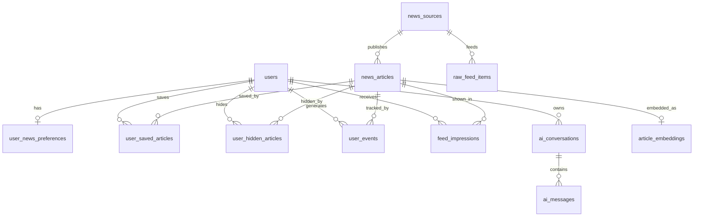

# GymUnity — SYSTEM_SPEC.md

> Generated from codebase as of 2026-02-24. Every claim below is sourced from code; items that could not be confirmed are marked **Unknown/Not confirmed**.

---

# 1) Project Summary

**GymUnity** is a full-stack, AI-powered fitness platform built as a graduation project. It pairs a **React (Vite + TypeScript)** single-page application with a **FastAPI (Python)** backend backed by **SQLite**. The product aims to help athletes and coaches plan workouts, consume fitness news via a **hybrid AI recommendation engine**, and receive corrective feedback from an AI coaching assistant.

The frontend is branded "Mindrift" in `index.html` `<title>` but the codebase and README refer to the project as **GymUnity** everywhere else.

### Primary user flows

- **Register / Login** — users create an account (roles: user, seller, coach) and log in to receive a JWT. Admin accounts are seeded, not self-registered.
- **AI Coach chat** — authenticated users converse with an LLM-backed (Groq) or deterministic stub fitness coach.
- **Fitness News feed** — personalized feed filtered by preferences, with save/hide/explore/chat capabilities.
- **Hybrid Recommended feed** — AI-powered recommendation engine with 4 candidate pools (vector search, topic match, trending, newest), explainability, and diversity reranking.
- **Event tracking** — user interactions (impressions, clicks, saves, hides, dwell) are tracked for the feedback loop.
- **Admin News management** — admin users CRUD news sources and trigger real RSS fetch jobs.
- **Product Store** — basic product listing with seller dashboard (localStorage-only persistence).
- **Home / Marketing pages** — animated landing page, "How it works" section.

### Current maturity level

| Area | Status |
|---|---|
| Auth (register/login/JWT) | ✅ Implemented |
| AI Coach v2 (Groq LLM) | ✅ Implemented |
| AI Coach v1 (deterministic plan builder) | ✅ Implemented |
| Fitness News CRUD + feed | ✅ Implemented |
| Admin News management | ✅ Implemented |
| RSS ingestion pipeline (real RSS fetcher) | ✅ Implemented — httpx + feedparser, multi-stage pipeline |
| News scheduler (APScheduler) | ✅ Implemented — wired in `main.py`, conditional on `NEWS_PIPELINE_ENABLED` |
| Enrichment (topics, keywords, quality) | ✅ Implemented — rule-based classification |
| Vector store abstraction | ✅ Implemented — Chroma (dev), Qdrant (prod), Null (graceful degradation) |
| Embedding service | ✅ Implemented — sentence-transformers, lazy-loaded |
| Hybrid recommendation engine | ✅ Implemented — 4 candidate pools, scoring, diversity, explainability |
| Event tracking & feedback loop | ✅ Implemented — POST /news/events batch endpoint |
| Product store | ⚠️ localStorage-only — no backend persistence |
| Computer vision / Posture detection | ❌ Not started |
| Workout/exercise management | ❌ Not started |
| Progress tracking | ❌ Not started |
| Dashboard | ⚠️ Placeholder page with logout button only |

---

# 2) Repository Structure

```
mindrift-replica/
├── .env.local                 # Frontend env vars (Gemini key, API base URL)
├── index.html                 # Vite HTML entry point (includes TailwindCSS CDN)
├── index.tsx                  # React entry – mounts <App /> inside BrowserRouter
├── App.tsx                    # Top-level router + auth state management
├── types.ts                   # Shared TS types: NavItem, UserRole, Product, User
├── vite.config.ts             # Vite config: port 3000, path alias @/, env injection
├── tsconfig.json              # TypeScript config
├── package.json               # Frontend deps: react 19, react-router-dom 7, gsap, framer-motion
│
├── components/                # Legacy / root-level components
│   ├── Navbar.tsx
│   ├── Hero.tsx
│   ├── Login.tsx
│   ├── Register.tsx
│   ├── ProductsSection.tsx
│   ├── SellerDashboard.tsx
│   ├── CommunitySection.tsx
│   ├── TeamSection.tsx
│   ├── ArchitectureFlow.tsx
│   └── ui/Button.tsx
│
├── lib/
│   └── storage.ts             # localStorage CRUD for products & local user store
│
├── src/
│   ├── components/
│   │   ├── ProtectedRoute.tsx  # JWT-guarded route wrapper
│   │   ├── AdminRoute.tsx      # role="admin" route wrapper
│   │   ├── AICoachPlanCard.tsx
│   │   ├── news/               # ArticleCard, FiltersBar, NewsHeader, etc.
│   │   └── reactbits/          # CardSwap, TextType, ProfileCard animations
│   ├── lib/
│   │   ├── api.ts              # Auth API client (register, login, me)
│   │   ├── newsApi.ts          # News + Admin + Events + Recommender API client
│   │   └── newsConstants.ts    # Topic, level, equipment constants
│   └── pages/                  # 13 page components
│       ├── Home.tsx
│       ├── LoginPage.tsx
│       ├── RegisterPage.tsx
│       ├── Dashboard.tsx
│       ├── AICoach.tsx (794 lines)
│       ├── HowItWorksPage.tsx
│       ├── NewsFeedPage.tsx
│       ├── NewsExplorePage.tsx
│       ├── NewsPreferencesPage.tsx
│       ├── NewsArticlePage.tsx
│       ├── NewsChatPage.tsx
│       └── AdminNewsPage.tsx
│
├── backend/
│   ├── .env / .env.example     # Backend env vars
│   ├── main.py                 # FastAPI entry point (scheduler wired)
│   ├── requirements.txt        # Python deps
│   ├── gymunity.db             # SQLite database file
│   ├── smoke_test.py           # Smoke test script
│   └── app/
│       ├── api/
│       │   ├── deps.py         # DI: get_db, get_current_user, require_role
│       │   └── routes/         # 8 route modules
│       │       ├── health.py
│       │       ├── auth.py
│       │       ├── users.py
│       │       ├── ai_chat.py
│       │       ├── ai_coach_v2.py
│       │       ├── news.py         # + GET /news/recommended
│       │       ├── admin_news.py
│       │       └── events.py       # POST /news/events
│       ├── core/
│       │   ├── config.py       # Settings (pydantic-settings) incl. vector DB, pipeline
│       │   └── security.py     # bcrypt hashing, JWT create/decode
│       ├── db/
│       │   ├── base.py         # SQLAlchemy declarative base
│       │   ├── session.py      # Engine + SessionLocal
│       │   └── init_db.py      # create_all + seed + ALTER TABLE migrations
│       ├── models/             # User, AIConversation, AIMessage, News* (12 tables)
│       ├── schemas/            # Pydantic request/response models
│       │   ├── news.py         # News schemas
│       │   └── events.py       # EventBatch / EventBatchResponse
│       ├── services/
│       │   ├── ai_coach/       # base, factory, groq_provider, stub_provider, rag
│       │   ├── news_service.py # Full news business logic (500+ lines)
│       │   ├── news_seed.py    # Mock article seeder
│       │   ├── news_fetcher.py # Real RSS pipeline (httpx + feedparser)
│       │   ├── news_sources.py # Default RSS source definitions (legacy)
│       │   ├── default_news_sources.py # 5 Tier-1 RSS sources
│       │   ├── news_scheduler.py # APScheduler (wired in main.py)
│       │   ├── enrichment.py   # Topic classification, quality scoring, keywords
│       │   ├── vector_store.py # Chroma/Qdrant/Null vector DB abstraction
│       │   ├── embedder.py     # sentence-transformers embedding service
│       │   └── recommender.py  # Hybrid recommendation engine (~350 lines)
│       └── pipeline/           # Placeholder NLP/RAG pipeline (empty stubs)
│           ├── embeddings.py
│           ├── ingest.py
│           ├── nlp.py
│           ├── orchestrator.py
│           ├── transform.py
│           └── vector_store.py
└── public/                     # Static assets (images, videos)
```

---

# 3) Tech Stack

## Frontend

| Aspect | Details |
|---|---|
| Framework | React 19.2.4 |
| Build tool | Vite 6.2.0 (`@vitejs/plugin-react`) |
| Routing | `react-router-dom` 7.13.0 — declarative `<Routes>/<Route>` in `App.tsx` |
| State management | React `useState`/`useEffect` — no global store (Redux, Zustand, etc.) |
| UI libraries | TailwindCSS (CDN in `index.html`), Lucide React icons, Framer Motion, GSAP |
| Form handling | Plain controlled inputs — no form library (React Hook Form, Formik, etc.) |
| Validation | Minimal client-side `required` attributes; server-side validation via Pydantic |
| HTTP client | Native `fetch` via wrapper functions in `src/lib/api.ts` and `src/lib/newsApi.ts` |
| API base URL | `VITE_API_BASE_URL` env var → defaults to `http://localhost:8000` |

## Backend

| Aspect | Details |
|---|---|
| Framework | FastAPI (Python) |
| Auth | JWT (HS256) via `python-jose` + bcrypt via `passlib` |
| ORM | SQLAlchemy (declarative mapped columns) |
| Database | SQLite (`gymunity.db` — file-based) |
| Vector DB | Chroma (dev) / Qdrant (prod) / Null (fallback) via `vector_store.py` |
| Embeddings | `sentence-transformers/all-MiniLM-L6-v2` (384-dim, lazy-loaded) |
| Scheduler | APScheduler — background RSS fetching |
| RSS parsing | `feedparser` + `httpx` |
| Key deps | `pydantic-settings`, `email-validator`, `python-dotenv`, `groq`, `httpx`, `feedparser`, `apscheduler` |
| Config | `pydantic-settings` `BaseSettings` reads from `backend/.env` |

## DevOps/Runtime

| Aspect | Details |
|---|---|
| Run frontend | `npm run dev` → Vite dev server on port 3000 |
| Run backend | `cd backend && uvicorn main:app --reload --port 8000` |
| Build frontend | `npm run build` → Vite production build to `dist/` |
| Deploy | **Unknown/Not confirmed** — no Dockerfile, CI config, or deploy scripts found |
| Testing | Smoke test script (`backend/smoke_test.py`); no unit test framework |

---

# 4) Environment Variables & Configuration

## Frontend (`.env.local`)

| Variable | Purpose | Referenced in |
|---|---|---|
| `GEMINI_API_KEY` | Injected as `process.env.API_KEY` and `process.env.GEMINI_API_KEY` | `vite.config.ts` line 14–15 |
| `VITE_API_BASE_URL` | Backend API base URL | `src/lib/api.ts` line 1 |

> **Note:** `GEMINI_API_KEY` is configured in Vite but **no frontend code references `process.env.API_KEY` or `process.env.GEMINI_API_KEY`**. The AI Coach page calls the backend, which uses `GROQ_API_KEY`. This appears to be a leftover from a previous approach.

## Backend (`backend/.env`)

| Variable | Purpose | Status |
|---|---|---|
| `CORS_ORIGINS` | Allowed CORS origins (CSV or JSON array) | ✅ Active |
| `ENV` | Environment name (`dev`) | ✅ Active |
| `APP_NAME` | FastAPI title | ✅ Active |
| `DATABASE_URL` | SQLAlchemy connection string | ✅ Active |
| `JWT_SECRET` | HMAC secret for JWT signing | ✅ Active |
| `JWT_ALG` | JWT algorithm (`HS256`) | ✅ Active |
| `ACCESS_TOKEN_EXPIRE_MINUTES` | Token TTL (default 10080 = 7 days) | ✅ Active |
| `NEWS_DATA_LAKE_PATH` | Path for news data storage | ⚠️ Configured but unused |
| `NEWS_PIPELINE_ENABLED` | Enable background RSS scheduler | ✅ Active — controls scheduler start in `main.py` |
| `NEWS_PIPELINE_INTERVAL_MINUTES` | Scheduler fetch interval (default 30) | ✅ Active |
| `VECTOR_DB_PROVIDER` | Vector store backend (`none`/`chroma`/`qdrant`) | ✅ Active — used by `vector_store.py` factory |
| `VECTOR_DB_URL` | Qdrant connection URL | ✅ Active (prod mode) |
| `VECTOR_DB_PATH` | ChromaDB persistence directory (default `./data/chroma`) | ✅ Active (dev mode) |
| `VECTOR_DB_NEWS_INDEX` | Vector index/collection name | ✅ Active |
| `VECTOR_DB_USER_INDEX` | Vector index for users | ⚠️ Configured but unused |
| `EMBEDDING_MODEL_NAME` | sentence-transformers model | ✅ Active — used by `embedder.py` |
| `GROQ_API_KEY` | Groq LLM API key | ✅ Active |
| `GROQ_MODEL` | LLM model name | ✅ Active |

### Example `.env` templates

**Frontend (`.env.local`)**
```env
GEMINI_API_KEY=your_gemini_api_key_here
VITE_API_BASE_URL=http://localhost:8000
```

**Backend (`backend/.env`)**
```env
CORS_ORIGINS=http://localhost:3000,http://127.0.0.1:3000,http://localhost:5173,http://127.0.0.1:5173
ENV=dev
APP_NAME="GymUnity API"
DATABASE_URL=sqlite:///./gymunity.db
JWT_SECRET=change_me_to_a_strong_random_string
JWT_ALG=HS256
ACCESS_TOKEN_EXPIRE_MINUTES=10080
NEWS_DATA_LAKE_PATH=./data/news
NEWS_PIPELINE_ENABLED=false
NEWS_PIPELINE_INTERVAL_MINUTES=30
VECTOR_DB_PROVIDER=none
VECTOR_DB_URL=http://localhost:6333
VECTOR_DB_PATH=./data/chroma
VECTOR_DB_NEWS_INDEX=gymunity-news
VECTOR_DB_USER_INDEX=gymunity-users
EMBEDDING_MODEL_NAME=sentence-transformers/all-MiniLM-L6-v2
GROQ_API_KEY=your_groq_api_key_here
GROQ_MODEL=llama-3.3-70b-versatile
```

---

# 5) Frontend Architecture

## App entry points and bootstrapping

1. **`index.html`** → loads TailwindCSS CDN, Inter font, import map for React, links `index.css`, mounts `index.tsx`.
2. **`index.tsx`** → `ReactDOM.createRoot` → wraps `<App />` in `<BrowserRouter>` + `<StrictMode>`.
3. **`App.tsx`** → manages `currentUser` state (from `localStorage`), defines all `<Routes>`.

## Routing map

| Path | Component | Auth | Notes |
|---|---|---|---|
| `/` | `Home` | No | Landing page with hero, stats, problem/solution cards, community, team |
| `/how-it-works` | `HowItWorksPage` | No | Static info page |
| `/login` | `LoginPage` → `Login` | No | Navbar hidden on this route |
| `/register` | `RegisterPage` → `Register` | No | |
| `/dashboard` | `Dashboard` | `ProtectedRoute` | Placeholder — logout button only |
| `/ai-coach` | `AICoach` | `ProtectedRoute` | Full chat UI, navbar hidden |
| `/news` | `NewsFeedPage` | `ProtectedRoute` | Personalized news feed |
| `/news/explore` | `NewsExplorePage` | `ProtectedRoute` | Unfiltered explore feed |
| `/news/preferences` | `NewsPreferencesPage` | `ProtectedRoute` | Topic/level/equipment preferences |
| `/news/article/:id` | `NewsArticlePage` | `ProtectedRoute` | Single article view |
| `/news/chat` | `NewsChatPage` | `ProtectedRoute` | Chat about news (stub) |
| `/admin/news` | `AdminNewsPage` | `AdminRoute` | News source management |
| `/store` | `ProductsSection` | No | Local-only product listing |
| `/seller` | `SellerDashboard` | Role = `seller` | Add/view products (localStorage) |
| `*` | Redirect to `/` | No | Catch-all |

## Key components and responsibilities

| Component | File | Responsibility |
|---|---|---|
| `Navbar` | `components/Navbar.tsx` | Top navigation, login/logout display, scroll-aware skin |
| `Login` | `components/Login.tsx` | Login form → calls `api.login()` → stores token → navigates to `/dashboard` |
| `Register` | `components/Register.tsx` | Registration form → calls `api.register()` + `api.login()` → stores token |
| `ProtectedRoute` | `src/components/ProtectedRoute.tsx` | Checks `localStorage` token → calls `GET /users/me` → redirects to `/login` on 401 |
| `AdminRoute` | `src/components/AdminRoute.tsx` | Same as ProtectedRoute but also checks `user.role === 'admin'` |
| `AICoach` | `src/pages/AICoach.tsx` | 794-line ChatGPT-style UI: profile sidebar, message history, sends to `/api/ai/coach/chat` |
| `Home` | `src/pages/Home.tsx` | Landing: hero, stats marquee, problem/solution cards, CardSwap, community, team, ArchitectureFlow |
| `CardSwap` | `src/components/reactbits/CardSwap.tsx` | GSAP-powered 3D card swap animation |
| `ArchitectureFlow` | `components/ArchitectureFlow.tsx` | Framer Motion animated node/arrow data flow visualization |

## State/data flow

- **Auth state** is managed in `App.tsx` via `currentUser` (React state) + `localStorage` (`access_token`, `user`).
- `syncUser()` in `App.tsx` writes/removes both state and localStorage.
- **Product state** is managed entirely in `App.tsx` via `products` state + `lib/storage.ts` (localStorage).
- **News data** is fetched per-page via `newsApi.ts` functions. No shared/global cache.
- **AI Coach** stores conversation history and user profile in localStorage keyed by `user.id`.
- **Event tracking** is available via `newsApi.sendEvents()` for batch submission of user interactions.

## Error handling & loading states

- `ProtectedRoute` / `AdminRoute` show "Checking session…" while verifying token.
- Most pages have local `isLoading` / `error` state with inline error messages.
- `api.ts` throws `ApiError` with status code; connection failures show Arabic error message.
- `newsApi.ts` auto-redirects to `/login` on 401 responses.

## Auth handling on frontend

- **Token storage:** `access_token` in `localStorage`.
- **User storage:** serialized `ApiUser` JSON in `localStorage` key `user`.
- **Token attachment:** `Authorization: Bearer <token>` header via `getAuthHeader()` in both `api.ts` and `newsApi.ts`.
- **Protected routes:** `ProtectedRoute` verifies token via `GET /users/me`; optimistically allows access during check to avoid logout on transient errors.
- **Logout:** removes `access_token` + `user` from localStorage, navigates to `/login`.

---

# 6) Backend Architecture

## App entry point & startup

- **`backend/main.py`** — loads `.env`, creates `FastAPI` app, adds CORS middleware, includes all 8 routers.
- **`on_startup`** event:
  1. Calls `init_db()` — creates all tables (including 4 new recommender tables), safely adds new columns via `ALTER TABLE`, seeds 5 Tier-1 RSS sources idempotently.
  2. Logs AI Coach diagnostics (provider type, env vars, PID).
  3. Conditionally starts the APScheduler news pipeline if `NEWS_PIPELINE_ENABLED=true`.
- **`on_shutdown`** event: gracefully stops the news scheduler.

## API modules structure

```
app/api/
├── deps.py          # get_db(), get_current_user(), require_role()
└── routes/
    ├── health.py        → GET /health
    ├── auth.py          → POST /auth/register, POST /auth/login
    ├── users.py         → GET /users/me
    ├── ai_chat.py       → GET /ai/health, POST /ai/chat  (v1 deterministic)
    ├── ai_coach_v2.py   → GET /api/ai/coach/debug, POST /api/ai/coach/chat  (v2 LLM)
    ├── news.py          → 11 news endpoints (feed, recommended, explore, saved, preferences, save/hide, chat)
    ├── admin_news.py    → 6 admin endpoints (CRUD sources, fetch-now, status)
    └── events.py        → POST /news/events (batch event tracking)
```

## Authentication flow

1. **Register:** `POST /auth/register` → validates email uniqueness, hashes password (bcrypt), creates `User`, returns `UserOut`. Allowed roles: `user`, `seller`, `coach` (admin excluded).
2. **Login:** `POST /auth/login` → looks up user by email, verifies password, creates JWT with `sub=user_id`, `role=user_role`, returns `TokenResponse`.
3. **Token validation:** `get_current_user()` dependency extracts Bearer token, decodes JWT, looks up user by ID. Returns 401 if any step fails.

## Authorization rules

- **`get_current_user`** — any valid JWT (used by most endpoints).
- **`require_role(['admin'])`** — used by all `admin_news.py` routes.
- **Seller dashboard** — frontend-only check (`currentUser?.role === 'seller'`), no backend enforcement.
- **Allowed roles at registration:** `user`, `seller`, `coach`.

> ✅ **Admin self-registration is blocked** — `admin` was removed from `ALLOWED_ROLES`.

## Database layer

- **ORM:** SQLAlchemy 2.0-style `Mapped` columns.
- **Base:** `app/db/base.py` — `declarative_base()`.
- **Session:** `app/db/session.py` — `create_engine` + `sessionmaker`; `check_same_thread=False` for SQLite.
- **Init:** `app/db/init_db.py` — `Base.metadata.create_all()` + safe column additions via `ALTER TABLE` + seeds 5 Tier-1 sources idempotently.
- **Migrations:** Manual `ALTER TABLE` in `init_db.py`; no Alembic configured.

## Error handling, validation, logging

- Pydantic schemas validate request bodies (email format, password min length 6, etc.).
- Routes raise `HTTPException` for business errors (400, 401, 403, 404).
- AI Coach v2 catches provider exceptions → returns 502 with error details.
- `logging.basicConfig(level=logging.INFO)` in `main.py`; per-module loggers in AI coach, fetcher, recommender.

## External integrations

| Integration | Status |
|---|---|
| **Groq API** (LLM) | ✅ Active — `AsyncGroq` client used in `GroqProvider` |
| **Vector DB (Chroma)** | ✅ Implemented — `ChromaVectorStore` for dev; configurable via `VECTOR_DB_PROVIDER` |
| **Vector DB (Qdrant)** | ✅ Implemented — `QdrantVectorStore` for production |
| **RSS feeds** | ✅ Active — real multi-stage pipeline: httpx fetch → feedparser parse → normalize → dedup → enrich → persist |
| **APScheduler** | ✅ Active — wired in `main.py`, runs every `NEWS_PIPELINE_INTERVAL_MINUTES` minutes |
| **sentence-transformers** | ✅ Implemented — lazy-loaded embedding model for vector search |

---

# 7) API Contract (Backend Endpoints)

## Health & Auth

| Method | Path | Auth | Request Body | Response | Errors |
|---|---|---|---|---|---|
| `GET` | `/health` | No | — | `{"status":"ok","service":"GymUnity API"}` | — |
| `POST` | `/auth/register` | No | `{name, email, password, role?}` | `UserOut {id, name, email, role, created_at}` | 400: email exists / invalid role |
| `POST` | `/auth/login` | No | `{email, password}` | `{access_token, token_type:"bearer"}` | 401: invalid credentials |
| `GET` | `/users/me` | Yes | — | `UserOut` | 401: not authenticated |

## AI Chat (v1 — deterministic)

| Method | Path | Auth | Request Body | Response | Errors |
|---|---|---|---|---|---|
| `GET` | `/ai/health` | No | — | `{"status":"ok","service":"GymUnity AI"}` | — |
| `POST` | `/ai/chat` | Yes | `{message, context:{goal,level,days_per_week,equipment,injuries?}, history:[]}` | `{reply, suggested_plan?:{week_overview, days:[{day,focus,exercises}]}}` | 401 |

## AI Coach (v2 — LLM-powered)

| Method | Path | Auth | Request Body | Response | Errors |
|---|---|---|---|---|---|
| `GET` | `/api/ai/coach/debug` | Yes | — | `{groq_key_loaded, provider, model, pid, cwd}` | 401 |
| `POST` | `/api/ai/coach/chat` | Yes | `{message, conversation_id?, goal?, locale:"ar"\|"en", user_profile?:{age?,height_cm?,weight_kg?,activity_level?,training_days?,injuries?}}` | `{conversation_id, reply, follow_up_questions?, meta:{provider,model,used_rag}}` | 401, 404, 502 |

## News (user endpoints)

| Method | Path | Auth | Request Body / Params | Response | Errors |
|---|---|---|---|---|---|
| `GET` | `/news/sources` | Yes | — | `NewsSourceOut[]` | 401 |
| `GET` | `/news/preferences` | Yes | — | `{topics[], level, equipment, blocked_keywords[]}` | 401 |
| `POST` | `/news/preferences` | Yes | `{topics[], level, equipment, blocked_keywords[]}` | `PreferencesOut` | 401 |
| `GET` | `/news/feed` | Yes | `?topic&source&q&from&to&page&page_size` | `NewsFeedResponse` | 401 |
| `GET` | `/news/recommended` | Yes | `?page&page_size&explain` | `{items[], page, page_size, total}` | 401 |
| `GET` | `/news/explore` | Yes | `?topic&source&q&from&to&page&page_size` | `NewsFeedResponse` | 401 |
| `GET` | `/news/saved` | Yes | `?page&page_size` | `NewsFeedResponse` | 401 |
| `GET` | `/news/articles/{id}` | Yes | — | `NewsArticleOut` | 401, 404 |
| `POST` | `/news/articles/{id}/save` | Yes | — | `{"status":"saved\|already_saved"}` | 401, 404 |
| `DELETE` | `/news/articles/{id}/save` | Yes | — | `{"status":"deleted\|not_saved"}` | 401 |
| `POST` | `/news/articles/{id}/hide` | Yes | — | `{"status":"hidden\|already_hidden"}` | 401, 404 |
| `POST` | `/news/chat` | Yes | `{message}` | `{reply, follow_up}` | 401 |

## Events (feedback loop)

| Method | Path | Auth | Request Body | Response | Errors |
|---|---|---|---|---|---|
| `POST` | `/news/events` | Yes | `{events: [{article_id, event_type, dwell_seconds?, session_id?}]}` | `{accepted, duplicates_skipped}` | 401, 422 |

## Admin News

| Method | Path | Auth | Request Body | Response | Errors |
|---|---|---|---|---|---|
| `GET` | `/admin/news/sources` | Admin | — | `NewsSourceOut[]` | 401, 403 |
| `POST` | `/admin/news/sources` | Admin | `{name, rss_url, category?, tags[], enabled?}` | `NewsSourceOut` | 400, 401, 403 |
| `PUT` | `/admin/news/sources/{id}` | Admin | `{name?, rss_url?, category?, tags?, enabled?}` | `NewsSourceOut` | 401, 403, 404 |
| `PATCH` | `/admin/news/sources/{id}/toggle` | Admin | — | `NewsSourceOut` | 401, 403, 404 |
| `DELETE` | `/admin/news/sources/{id}` | Admin | — | 204 No Content | 401, 403, 404 |
| `POST` | `/admin/news/fetch-now` | Admin | — | `FetchNowResponse` (real pipeline stats) | 401, 403 |
| `GET` | `/admin/news/status` | Admin | — | `NewsStatusOut` (real pipeline data) | 401, 403 |

---

# 8) Data Model

## Tables and relationships



### `users`

| Column | Type | Constraints |
|---|---|---|
| `id` | Integer | PK, auto-increment |
| `name` | String | NOT NULL |
| `email` | String | UNIQUE, NOT NULL, indexed |
| `password_hash` | String | NOT NULL |
| `role` | String | NOT NULL, default `'user'` |
| `created_at` | DateTime | NOT NULL, default `utcnow` |

### `ai_conversations`

| Column | Type | Constraints |
|---|---|---|
| `id` | String (UUID) | PK |
| `user_id` | Integer | FK → `users.id`, indexed |
| `goal` | String | nullable |
| `locale` | String | NOT NULL, default `'ar'` |
| `created_at` | DateTime | NOT NULL, default `utcnow` |

### `ai_messages`

| Column | Type | Constraints |
|---|---|---|
| `id` | String (UUID) | PK |
| `conversation_id` | String | FK → `ai_conversations.id`, indexed |
| `role` | String | NOT NULL (`'user'` / `'assistant'`) |
| `content` | Text | NOT NULL |
| `created_at` | DateTime | NOT NULL, default `utcnow` |

### `news_sources`

| Column | Type | Constraints |
|---|---|---|
| `id` | Integer | PK |
| `name` | String | NOT NULL |
| `rss_url` | String | UNIQUE, NOT NULL, indexed |
| `category` | String | nullable |
| `tags` | String | CSV-encoded, nullable |
| `enabled` | Boolean | NOT NULL, default `True` |
| `created_at` | DateTime | NOT NULL, default `utcnow` |
| `last_fetched_at` | DateTime | nullable |
| `priority` | Integer | default `1` — source quality tier |
| `fetch_error_count` | Integer | default `0` — auto-disable at 5 consecutive failures |
| `last_error` | Text | nullable |

### `news_articles`

| Column | Type | Constraints |
|---|---|---|
| `id` | Integer | PK |
| `source_id` | Integer | FK → `news_sources.id`, indexed |
| `title` | String | NOT NULL |
| `link` | String | NOT NULL |
| `guid` | String | nullable |
| `unique_hash` | String | NOT NULL, composite unique with `source_id` |
| `published_at` | DateTime | nullable, indexed |
| `author` | String | nullable |
| `summary` | Text | NOT NULL, default `''` |
| `content` | Text | nullable |
| `image_url` | String | nullable |
| `tags` | String | CSV-encoded, nullable |
| `created_at` | DateTime | NOT NULL, default `utcnow` |
| `language` | String | default `'en'` |
| `topics_json` | Text | default `'[]'` — JSON array of classified topics |
| `keywords_json` | Text | default `'[]'` — JSON array of extracted keywords |
| `quality_score` | Float | default `0.5` — heuristic quality (0.0–1.0) |
| `popularity_score` | Float | default `0.0` — aggregated from user events |
| `content_hash` | String | nullable — SHA-256 for change detection |

### `raw_feed_items`

| Column | Type | Constraints |
|---|---|---|
| `id` | Integer | PK |
| `source_id` | Integer | FK → `news_sources.id`, indexed |
| `guid` | Text | nullable |
| `url` | Text | NOT NULL |
| `url_hash` | Text | NOT NULL |
| `title_raw` | Text | nullable |
| `summary_raw` | Text | nullable |
| `content_raw` | Text | nullable |
| `author_raw` | Text | nullable |
| `image_url_raw` | Text | nullable |
| `published_raw` | Text | nullable |
| `fetched_at` | DateTime | NOT NULL, default `utcnow` |
| `status` | Text | default `'pending'` |
| `error_message` | Text | nullable |

### `article_embeddings`

| Column | Type | Constraints |
|---|---|---|
| `id` | Integer | PK |
| `article_id` | Integer | FK → `news_articles.id`, UNIQUE |
| `content_hash` | Text | NOT NULL |
| `model_name` | Text | NOT NULL |
| `dimensions` | Integer | NOT NULL |
| `vector_id` | Text | NOT NULL |
| `created_at` | DateTime | NOT NULL |
| `updated_at` | DateTime | nullable |

### `user_events`

| Column | Type | Constraints |
|---|---|---|
| `id` | Integer | PK |
| `user_id` | Integer | FK → `users.id`, indexed |
| `article_id` | Integer | FK → `news_articles.id`, indexed |
| `event_type` | Text | NOT NULL |
| `dwell_seconds` | Real | nullable |
| `session_id` | Text | nullable |
| `created_at` | DateTime | NOT NULL, default `utcnow` |

### `feed_impressions`

| Column | Type | Constraints |
|---|---|---|
| `id` | Integer | PK |
| `user_id` | Integer | FK → `users.id`, indexed |
| `article_id` | Integer | FK → `news_articles.id` |
| `position` | Integer | NOT NULL |
| `feed_type` | Text | NOT NULL |
| `created_at` | DateTime | NOT NULL |

### `user_news_preferences`

| Column | Type | Constraints |
|---|---|---|
| `user_id` | Integer | PK, FK → `users.id` |
| `topics` | String | CSV-encoded |
| `level` | String | default `'beginner'` |
| `equipment` | String | default `'gym'` |
| `blocked_keywords` | String | CSV-encoded |
| `updated_at` | DateTime | default `utcnow` |

### `user_saved_articles` / `user_hidden_articles`

| Column | Type | Constraints |
|---|---|---|
| `id` | Integer | PK |
| `user_id` | Integer | FK → `users.id`, indexed |
| `article_id` | Integer | FK → `news_articles.id`, indexed |
| `created_at` | DateTime | default `utcnow` |
| — | — | Composite unique: `(user_id, article_id)` |

### Migrations

**No migration tool configured** (no Alembic). Schema is created via `Base.metadata.create_all()` at startup. New columns are added via manual `ALTER TABLE` statements in `init_db.py` (safe to run idempotently). Deleting `gymunity.db` resets the database.

---

# 9) End-to-End Data Flows

### Registration

```
User fills Register form (components/Register.tsx)
  → POST /auth/register {name, email, password, role}
    → backend validates → hashes password → inserts User → returns UserOut
  → POST /auth/login {email, password}
    → backend verifies → creates JWT → returns {access_token}
  → localStorage.setItem('access_token', token)
  → GET /users/me (with Bearer token)
    → returns UserOut
  → localStorage.setItem('user', JSON.stringify(user))
  → App.syncUser(user) → updates React state
  → navigate('/dashboard')
```

### Login

```
User fills Login form (components/Login.tsx)
  → POST /auth/login {email, password}
    → backend verifies → JWT → {access_token}
  → localStorage.setItem('access_token', token)
  → GET /users/me
    → returns UserOut
  → localStorage.setItem('user', JSON.stringify(user))
  → App.syncUser(user)
  → navigate('/dashboard')
```

### AI Coach Chat (v2)

```
User opens /ai-coach → ProtectedRoute verifies token
  → AICoach component loads profile from localStorage
  → User types message → sends:
    POST /api/ai/coach/chat {message, conversation_id?, goal?, locale, user_profile?}
      → get_current_user() validates JWT
      → resolve/create AIConversation in DB
      → load conversation history from ai_messages table
      → call _provider.generate_reply() (GroqProvider or StubProvider)
        → GroqProvider: builds system prompt + history → Groq API → parses reply + follow-ups
        → StubProvider: checks profile completeness → returns template response
      → persist user + assistant AIMessage rows in DB
      → return {conversation_id, reply, follow_up_questions, meta}
  → UI appends messages, shows follow-up suggestions
  → messages saved to localStorage keyed by user ID
```

### News Feed (Standard SQL-based)

```
User navigates to /news → ProtectedRoute verifies token
  → NewsFeedPage calls:
    GET /news/sources (for filter dropdown)
    GET /news/feed?page=1&page_size=6 (with user's saved preferences)
      → backend loads UserNewsPreference → applies topic/source/search/date filters
      → excludes hidden articles → orders by relevance score + published_at
      → paginates → checks saved status per article → returns NewsFeedResponse
  → User can save/unsave (POST/DELETE /news/articles/{id}/save)
  → User can hide (POST /news/articles/{id}/hide)
```

### Recommended Feed (Hybrid AI-powered)

```
GET /news/recommended?page=1&page_size=12&explain=true
  → Build user profile (explicit prefs + implicit affinities from user_events)
  → Generate candidates from 4 pools:
    1. Vector search (embed user topics → cosine top-50)
    2. Topic-based (SQL: articles matching user's top topics, 14 days)
    3. Trending (SQL: top by popularity_score, 3 days)
    4. Newest (SQL: most recent, no topic filter)
  → Merge + dedup → ~80-100 candidates
  → Filter: hidden, blocked keywords, disabled sources, stale (>14 days), already seen (24h)
  → Score: w1×similarity + w2×recency + w3×pref_match + w4×popularity + w5×quality - penalties
  → Diversity rerank: max 2/source, 3/topic
  → Paginate + add why_this explainability
  → Log feed_impressions
  → Return response with articles + optional explanations
```

### Event Tracking (Feedback Loop)

```
POST /news/events {events: [{article_id, event_type, dwell_seconds?, session_id?}]}
  → Dedup: skip events within 5-minute window for same (user, article, event_type)
  → Update popularity_score on articles (click=+1, save=+3, hide=-5)
  → Insert accepted events into user_events table
  → Return {accepted, duplicates_skipped}
```

### RSS Ingestion Pipeline

```
Scheduler tick (every 30 min) OR Admin: POST /admin/news/fetch-now
  → For each enabled source:
    1. httpx GET rss_url (15s connect timeout, 30s read, 3 retries)
    2. feedparser.parse() → extract entries
    3. Normalize: strip HTML, canonical URL, parse dates
    4. Dedup: SHA-256(canonical_url) → check raw_feed_items
    5. Insert raw_feed_items (status=pending)
    6. Enrich: classify topics, extract keywords, compute quality score
    7. Upsert news_articles (content_hash for change detection)
    8. If VECTOR_DB_PROVIDER != 'none': embed + upsert vector DB
  → On error: increment fetch_error_count → auto-disable source at 5 consecutive failures
  → Update last_fetched_at on source
```

### Admin News (source management)

```
Admin navigates to /admin/news → AdminRoute verifies token + role='admin'
  → AdminNewsPage calls GET /admin/news/sources
  → Admin can CRUD sources, toggle enable/disable, trigger fetch-now
  → POST /admin/news/fetch-now
    → triggers real RSS ingestion pipeline → returns stats with actual counts
```

---

# 10) What Exists vs What's Missing

## ✅ Implemented

- User registration and login with JWT (roles: user, seller, coach; admin blocked from self-register)
- Protected and admin route guards (frontend + backend)
- AI Coach v1 (deterministic workout plan builder)
- AI Coach v2 (Groq LLM integration with Arabic/English support, conversation persistence)
- AI Coach stub provider (works without API key)
- News articles: personalized feed, explore, save, unsave, hide, preferences
- **Hybrid recommended feed** with 4 candidate pools, vector search, scoring, diversity, explainability
- Admin news source CRUD + toggle + real fetch-now pipeline + status
- **Real RSS ingestion** — multi-stage pipeline (fetch → parse → normalize → dedup → enrich → persist)
- **APScheduler** — background news fetching, wired in `main.py`
- **Enrichment** — rule-based topic classification, frequency-based keyword extraction, quality scoring
- **Vector store** — Chroma (dev), Qdrant (prod), Null (graceful degradation)
- **Embedding service** — sentence-transformers, lazy-loaded, batch processing
- **Event tracking** — `POST /news/events` batch endpoint with dedup and popularity updates
- **Feed impressions** — logged per recommendation request
- 5 Tier-1 default RSS sources seeded on startup
- Mock article seeding on DB init
- Home page with animated sections (CardSwap, ArchitectureFlow, marquee)
- Navbar with scroll-aware styling
- Product store listing (localStorage-backed)
- Seller dashboard (localStorage-backed)

## ⚠️ Partially implemented

- **Dashboard** (`src/pages/Dashboard.tsx`) — placeholder page with logout button only.
- **News chat** (`POST /news/chat`) — returns hardcoded stub: `"Pipeline not connected yet."`.
- **HowItWorksPage** — returns minimal JSX.
- **Frontend event emission** — `sendEvents()` API exists but pages don't yet emit events automatically.

## ❌ Not implemented / missing

- **RAG pipeline** — `pipeline/` directory contains empty stubs and `rag.py` returns `[]`.
- **Workout/exercise management** — no models, endpoints, or UI.
- **Progress tracking/analytics** — nothing present.
- **Computer vision / posture detection** — not started.
- **Database migrations (Alembic)** — none configured (uses manual ALTER TABLE).
- **Automated unit tests** — no test framework; only `smoke_test.py`.
- **CI/CD** — no configuration.
- **Email verification / password reset** — not implemented.
- **Rate limiting** — not implemented.
- **Refresh tokens** — not implemented (access token only, 7-day TTL).

---

# 11) Risks / Bugs / Inconsistencies (Code Review Findings)

| # | Severity | Symptom | Likely cause | Suggested fix |
|---|---|---|---|---|
| 1 | ~~**High**~~ ✅ Fixed | ~~Anyone can self-register as `admin`~~ | `admin` removed from `ALLOWED_ROLES` | Fixed |
| 2 | ~~**High**~~ ✅ Fixed | ~~`.env` committed to repo~~ | `backend/.env` added to `.gitignore` | Fixed — rotate exposed keys |
| 3 | **High** | `JWT_SECRET` is `change_me` in `.env` | Weak/default secret | Generate a strong random secret for production |
| 4 | **Med** | `datetime.utcnow()` usage throughout backend | `utcnow()` is deprecated in Python 3.12+ | Replace with `datetime.now(timezone.utc)` |
| 5 | **Med** | Dual auth systems: `lib/storage.ts` (localStorage users) + backend JWT | Legacy localStorage auth not fully removed | Remove `lib/storage.ts` user functions |
| 6 | **Med** | `GEMINI_API_KEY` injected in Vite but never used | Dead config from previous approach | Remove the `define` entries |
| 7 | **Med** | Product store uses localStorage only | Products not tied to backend | Create backend models + API |
| 8 | **Med** | Two separate `request()` wrappers | Different error behavior | Consolidate HTTP client |
| 9 | **Low** | `<title>` in `index.html` says "Mindrift" | Naming mismatch | Update to `<title>GymUnity</title>` |
| 10 | **Low** | `on_event('startup')` is deprecated in FastAPI | Should use lifespan context manager | Migrate to `@asynccontextmanager` lifespan |

---

# 12) Quick Start (Developer Onboarding)

## Backend

```powershell
cd backend
python -m venv .venv
.\.venv\Scripts\Activate.ps1
pip install -r requirements.txt

# Create .env from template
copy .env.example .env
# Edit .env: set JWT_SECRET to a strong value, add GROQ_API_KEY if available

# Start the server
uvicorn main:app --reload --port 8000
```

Swagger UI: [http://localhost:8000/docs](http://localhost:8000/docs)

## Frontend

```powershell
# From project root (mindrift-replica/)
npm install
npm run dev
```

App runs at: [http://localhost:3000](http://localhost:3000)

## Enabling the News Pipeline

```env
# In backend/.env:
NEWS_PIPELINE_ENABLED=true              # Auto-fetches every 30 min
VECTOR_DB_PROVIDER=chroma               # Enable vector search
# pip install chromadb sentence-transformers  # Extra deps for embeddings
```

Or trigger manually: `POST /admin/news/fetch-now` (requires admin token).

## Required setup steps

1. **Python 3.10+** and **Node.js 18+** must be installed.
2. Backend `.env` must exist — copy from `.env.example`.
3. For AI Coach (LLM mode), set a valid `GROQ_API_KEY` in `backend/.env`. Without it, the stub provider is used.
4. Frontend `.env.local` should have `VITE_API_BASE_URL=http://localhost:8000`.
5. Start backend **before** frontend (frontend calls backend API on protected routes).

## Common troubleshooting

| Issue | Fix |
|---|---|
| `ModuleNotFoundError: No module named 'app'` | Run `uvicorn` from inside `backend/` directory |
| CORS errors in browser console | Ensure frontend origin (`http://localhost:3000`) is in `backend/.env` `CORS_ORIGINS` |
| Login works but protected routes redirect to `/login` | Check that `localStorage.getItem('access_token')` has a valid token |
| AI Coach returns stub responses | Verify `GROQ_API_KEY` is set and valid in `backend/.env` |
| Database schema changes not reflected | Delete `gymunity.db` and restart backend (note: this drops all data) |
| News pipeline not running | Set `NEWS_PIPELINE_ENABLED=true` in `.env` and restart |
| Vector search not working | Set `VECTOR_DB_PROVIDER=chroma` and install `chromadb` + `sentence-transformers` |

---

# 13) Verification Checklist

## Auth tests

- [x] `POST /auth/register` with valid payload → 201, returns `UserOut`
- [x] `POST /auth/register` with duplicate email → 400
- [x] `POST /auth/register` with `role=admin` → 400 (blocked)
- [x] `POST /auth/login` with correct credentials → 200, returns `access_token`
- [ ] `POST /auth/login` with wrong password → 401
- [x] `GET /users/me` with valid Bearer token → 200, returns user data
- [ ] `GET /users/me` without token → 401

## API tests

- [x] `GET /health` → 200 `{"status":"ok"}`
- [ ] `GET /ai/health` → 200
- [ ] `POST /ai/chat` with valid context → returns `ChatResponse` with plan
- [ ] `POST /api/ai/coach/chat` with valid message → returns `CoachChatResponse`
- [x] `GET /news/sources` → 200, returns 5 sources
- [x] `GET /news/feed` with Bearer token → returns paginated articles
- [x] `GET /news/recommended` → 200, returns hybrid recommender results
- [x] `POST /news/events` with empty batch → 200, returns `{accepted:0, duplicates_skipped:0}`
- [ ] `POST /news/articles/{id}/save` → 201
- [ ] `DELETE /news/articles/{id}/save` → 200
- [ ] `POST /news/articles/{id}/hide` → 201
- [ ] Admin endpoints return 403 for non-admin users

## Frontend route tests

- [ ] `/` renders Home page without auth
- [ ] `/login` renders login form, can submit credentials
- [ ] `/register` renders registration form, can create account
- [ ] `/dashboard` redirects to `/login` when not authenticated
- [ ] `/ai-coach` redirects to `/login` when not authenticated
- [ ] `/news` loads feed after login
- [ ] `/admin/news` redirects non-admin users to `/news`
- [ ] `/store` renders product listing
- [ ] Unknown routes redirect to `/`

## DB connection tests

- [x] Backend starts without errors (SQLite file created)
- [x] All 12 tables created on first startup
- [x] 5 Tier-1 RSS sources seeded on clean DB
- [x] User data persists across server restarts
